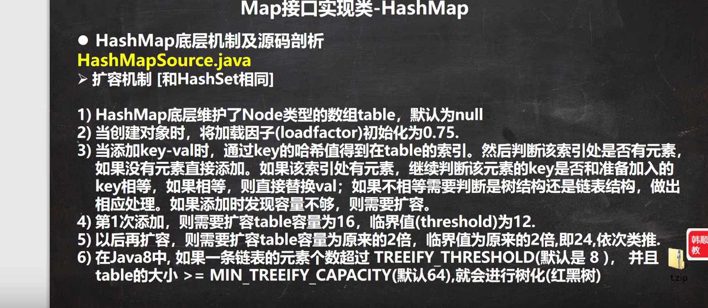
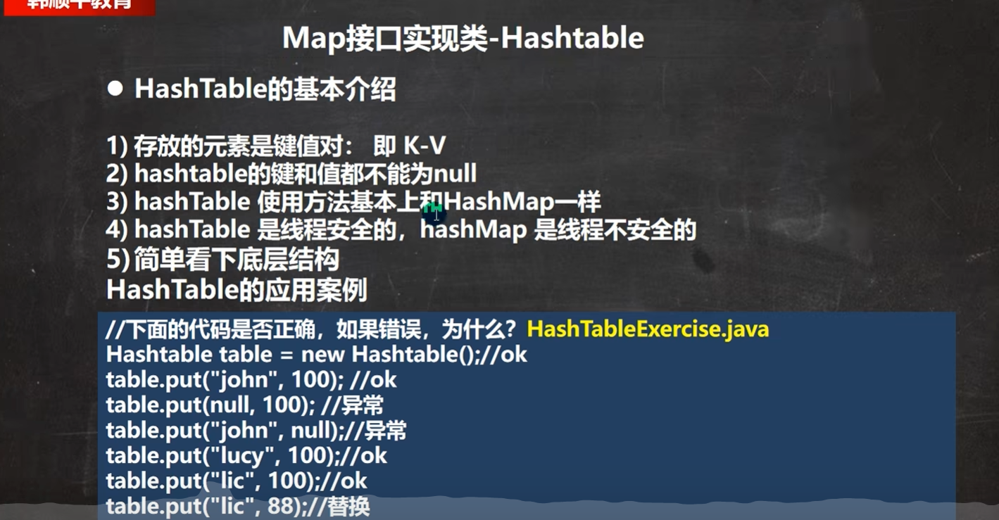
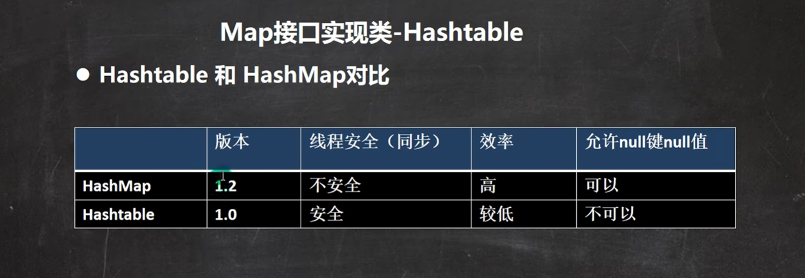
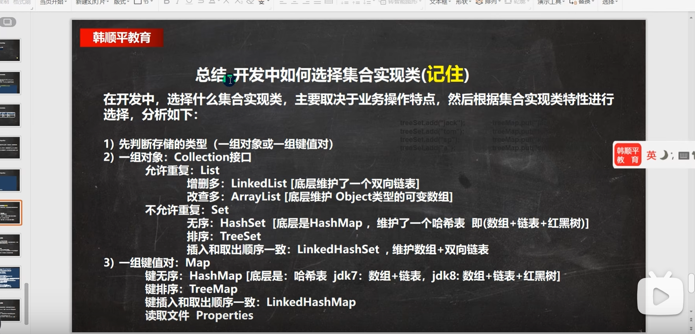
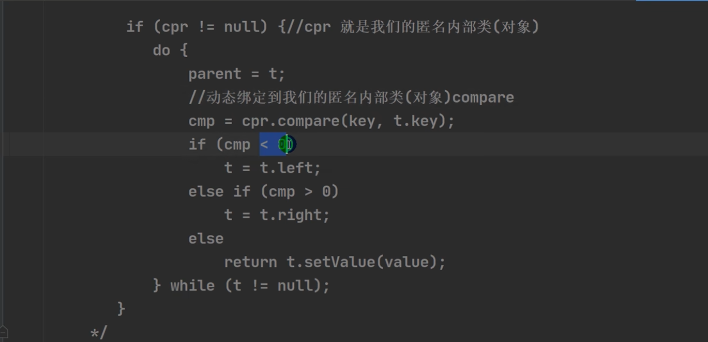
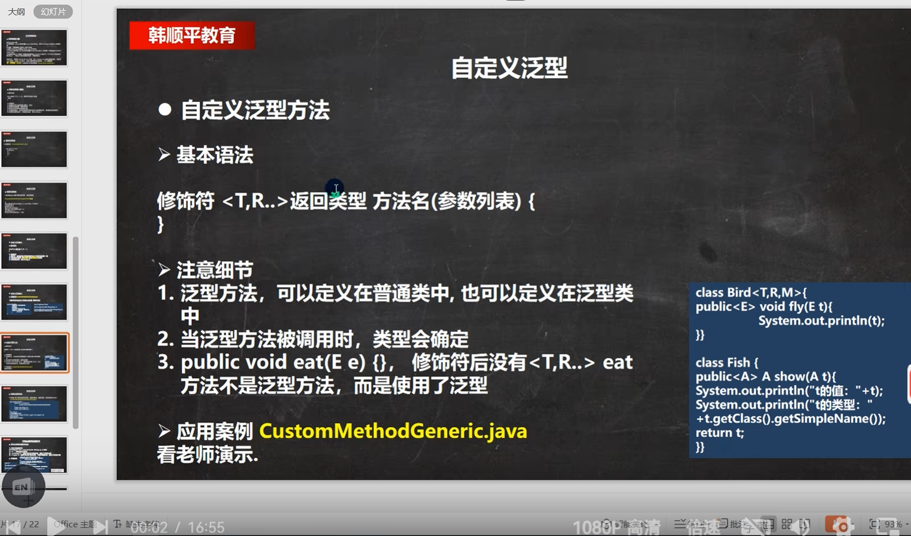

#### 2.19 DOS 命令(了解)

Dos： Disk Operating System 磁盘操作系统, 简单说一下windows的目录结构。

Dos系统：接收，解析，执行指令

相对路径和绝对路径。

相对路径：

../:到达上一级 

常用指令

1) 查看当前目录是有什么内容 dir  dir d:\abc2\test200 2) 
2) 切换到其他盘下：盘符号 cd:changedirectory 案例演示：切换到 c盘 cd/D c: 
3) 切换到当前盘的其他目录下 (使用相对路径和绝对路径演示), ..\表示上一级目录 案例演示： cd d:\abc2\test200 cd..\..\abc2\test200 4) 切换到上一级： 案例演示： cd.. 5) 切换到根目录：cd\ 案例演示：cd\ 6) 查看指定的目录下所有的子级目录 tree 7)
4) 清屏 cls[苍老师] 8) 
5) 退出DOS exit

md：创建目录

rd：删除目录

copy：

#### 变量：

变量是程序的基本组成单位（类型 名称 值）

变量定义：int a

变量赋值  a = 10；

定义变量==分配内存

计算机=》人

内存=》大脑

变量的不同类型

```java
pubilc class Var02{

int age  = 10;
double score = 88.9
char gander = '男'
}
//字符类型需要用''或""表示
```

detail 

不同类型的相互转换：

有些完全不行，有些会发生数据精度损失

一个程序只含一个public类

不同类型变量运算的规律：

##### +号的使用：

“100”+10   凭借字符串

Plus：加的单词


类：方法的集合，用类创建对象。


java类的组织形式：包（不同文件夹）----> 类，接口，异常 枚举----->字段，构造器 成员方法  构造器：构造不同数据，可供方法使用

算数运算符：

5/9   = 0；

应写为：5.0/9；

int类型不会保留小数。


三元运算符：

条件表达式： 条件表达式

补码可以统一正数和负数

计算机中所有的运算都是按补码运算的

2.24

如果 a%b a是小数 则其等于 a-（int）a%b*b

有小数参与的运算最后得到的结果是近似值

**使用 `Integer.parseInt()` 方法：**[PingCode 文档+4PingCode 文档+4CSDN 博客+4](https://docs.pingcode.com/baike/403227) 这是最常用的方法，将字符串转换为基本数据类型 `int`。 如果字符串无法解析为有效的整数，将抛出 `NumberFormatException` 异常。 

double  num = 3d ，其中的d代表3是double类型 

区分键盘输入和String转化

Scanner myscanner = new Scanner(System.in);

int grade = myscanner.nextInt();

String a = "12";

int aa = Integer.parseInt();

double aa = double.parseDouble();

`equals()` 方法比较的是两个字符串的内容是否相等，返回一个 `boolean` 类型的结果。6

如果您需要忽略大小写进行比较，可以使用 `equalsIgnoreCase()` 方法

switch语句

defauilt 

break 跳出swith  （穿透）

swith 表达式中的值必须和case中的可以匹配  String无法转化为char

case之后只能是常量。byte short int char 枚举 String（返回值的类型）  


for（） while（） （）中是循环继续的条件

~~~java
for(;;){}//无限循环
for(int i = 0,int j = 1;;)//for中可以定义多个变量。，用逗号隔开。
~~~

for中的编程思想：

**化繁为简 ：复杂->到简单**

**先死后活：先考虑固定值**

while（） 先判断再运行

do while（）； 先运行再判断  后面有一个分号

循环四要素：循环变量初始化。循环条件，循环体，循环变量迭代

do while（）括号中必须是循环外的变量。

随用随弃

2025.2.25

**break**：跳出循环。

break 可通过标签（label）来指定退出那一层。

标签（label）名字随便取，尽量不标签。

**如果没有指定break 默认退出最近的循环体。**

~~~java
abc1:
for(int j = 0;j<4;j++){
abc2:
for(int i= = 0;i<10;i++ ){
if(i==2){
break abc1; //直接跳出外层循环。
}
}
}
~~~

注意变量的作用范围，函数内部的变量的作用范围是函数内部。

一般一个变量一种含义

**continue**

continue也可以使用标签。

跳出本次循环，不再执行下面的代码（循环体）  跳过某些数据的操作。

**return** 

跳出所在方法。 跳出主方法 跳出程序

3位数除以100获取百位

2024.2.26

***数组***

可以存放多个同类型的数据 一组数据

~~~java
double[] hens  = {3,5,32,52};
//用for遍历数组
for(int i = 0;i<10;i++){hens[i]}
//动态初始化1
int[] a = new int[10];//数组类型 数组名 数组大小（申请的空间） 默认为零
//动态初始化2
//先声明，再创建数组
int[] a; //没有指向任何空间，空指针
a = new int[10];//分配空间，int[10]分配空间的类型和大小
//静态初始化
int a[] = {1,2,3,4,5,6}; //不用动态赋值了。元素不多时使用。
//数组细节
//1.数组数据类型相同，（相同数据类型的集合），
//自动类型装换。
//2.可储存引用类型 String a[] = {"a"};
//3.小心下表越界（不是我的空间）
//4.数组是引用类型，本质是对象
~~~

在 Java 中，数组是对象类型，数组名实际上是指向该数组对象的引用。这意味着数组名指向的是数组对象在内存中的位置，而不是数组元素的地址。因此，数组名本身并不直接指向数组元素的内存地址。

在 C 语言中，数组名是指向数组首元素的指针，可以通过指针运算来访问数组元素。而在 Java 中，数组名是一个引用，指向数组对象的内存地址。因此，Java 中的数组名与 C 语言中的指针有所不同。

数组赋值机制：**数组在默认情况下是引用传递，赋的值是地址**

普通类型是：拷贝

~~~java
int[] a = {1,2,3};
int[] b = a;//实际上a，b是同一个数组，给的是相同的地址
~~~

数组拷贝

~~~
int[] a = {3,43,4,3};
int[] b = new int[a.length];
~~~

数组反转

~~~java
int[] arr = {11,22,33,44,55,66}
int i = 0;
int j = arr.length-1;
while(i<j){
int swap = arr[i];
arr[i] = arr[j];
 arr[j] = swap;
    i++;
    j--;
}
~~~

数组扩容

~~~java
int arr[] = {1,2,3};
int Newarr[] = new int[arr.length+1];
for(int i = 0;i<arr.length;i++){
Newarr[i] = arr[i];
}
Newarr[Newarr.length-1] = 4;
arr = Newarr;//将arr所指的空间变为Newarr所指的空间，实现扩容。原空间会自动销毁。
~~~

//数组大小不可变

冒泡排序

二分查找


二维数组：

~~~java
//二维数组:一维数组的元素是数组。
//
int[][] arr = {{0,0,0,0},{1,1,1,1}};
//二维数组的遍历
for(int i = 0;i<arr.length;i++){//相当于一维
for(int j = 0;j<arr[i].length;j++){  // 元素对应的一维数组的长度
    System.out.println(arr[i][j]);//i代表行，j代表列
}
}
~~~


杨辉三角

~~~java
int[][] yanghui  = new int[10][];
for(int i = 0;i<yanghui.length;i++){
`//给每个一维数组开辟空间。
yanghui[i] = new int [i+1];
for(int j = 0;j<yanghui[i].kength;j++){
if(j==0|| j==yanghui[i].length-1){
yanghui[i][j] = yanghui[i-1][j]+yanghui[i-1][j-1];
}
}
}
//不知道的点：对于二维数组中的一维数组，可以独立申请空间
~~~

//创建 二维数组，一个有3个一维数组，但是每个一维数组还没有开数据空间 int[][] arr = new int[3][]

~~~
String Str[] = new String[]{"n"};//可以
~~~

~~~java
//定位加扩容
int arr[] = {10.12,45,90}
int num = 23;
int index = -1;
for(int i = 0;i<arr.length;i++){
    if(num<=arr[i]){
index = i;
        break;
    }
}
if(index==-1){
index = arr.length-1;
}
int arr2[] = new int[arr.length+1];
int j = 0;
for(int i = 0;i<arr2.length;i++){
if(i!=index){
arr2[i] = arr[j];
    j++;//
}else{
arr2[i] = num;
}
}
//在扩容过程中插入数组。
~~~

随机数的生成：（）

生成1-100的随机整数：（int ）(Math.random()*100)+1;

2.27

~~~java
chat arr1[] = {'a','b'};
char arr2 = arr1; //让arr2指向arr1.
~~~


我亦无他，唯手熟尔。


面向对象编程：

~~~java
//减少重复造轮子
//将相关的数据储存在一起，利于管理。变量名和数据关联明确（数组不可）
//可直接调用数据，形成方法，解决问题
~~~

类与对象：（oop）

~~~java
//优点：便于管理和修改。
//类：事物的模板。 新的一种数据类型（数据和方法）
//对象 ：对类的实例化，对应类（数据类型）的一个实例，与int的一个实例是 100相似。
//类：具有某种能力的人
//类：具体的人。
~~~

对象在内存中的存在形式


属性的概念：

~~~java
//成员变量 == field
//属性的访问修饰符:控制数据的访问范围的
//public proctected 默认 private。
//属性也有默认值
~~~

~~~
Person p2 = p1;//p2和p1都储存地址，所有现在他们指向同一对象
~~~

**2025.2.28**

~~~java
piblic void speak(){
System.out.println("");
}
p1.speak();//接收数据 形参列表。（接收调用者的输入）
public int getSum(int num1,int num2){
int res = num1 + num2;
    return res;//返回int型数据，可被接收。
}
~~~

**方法的调用机制**


~~~java
//栈帧不存放代码，只存放数据（根据代码对数据操作）
//栈中反映代码对数据的操作。
//代码执行完毕退栈。
~~~

方法的好

~~~处

~~~

~~~java
//可简化对数据的操作（避免重复造轮子）同时便于修改。
//一次实现，多次使用（复用性）
//可以将实现的细节封装起来，供用户使用。
//可直接对数据进行处理
//对特定数据可定制方法。
~~~

方法定义


  使用细节

**一个方法一个放回。放回多个，放回数组。**

~~~java
//public 访问修饰符 (控制方法的使用范围)
//public protected 默认 private
//一个方法一个放回。放回多个，放回数组。
public int[] getSUmAndSUb(int n1,int n2){
int[] res = new int[2];
    res[0] = n1+n2;
    res[1] = n1-n2;
    return res;
}
//return 可返回任何类型。
//方法名驼峰式
形参列表
    //传入的值兼容即可。不能有精度损失。
    //形参，和实参
    //方法之中不能嵌套方法定义，但可调用
    
    //同一个类中的方法可以直接调用
    class A{
public void print(int n){
System.out.println();
}
        public void sayOK(){
print(10);
        }
    }
//跨类了，需要创建对象在调用。

~~~

方法的传参机制 

~~~java
//传值，传址
//一般情况（基本类）是传值。在栈中是创建一个新的数据内存
//引用数据类型传递地址
//本质上来来说就是有什么给什么。
~~~

**克隆对象**

~~~java
public classs aa{
main{
    Person p = new Person();
    p.name = "mi";
    p.age = 18;
    MyTools tool = new MyTools();
    Person.p2 = tool.copyPerson(p);
     
}
}
class person{
String name;
int age;
}

//克隆对象
class MyTools{
    pubilc Person copyPerson(Person p){
	Person newp = new Person();
        newp.name = p.name;
        newp.age = p.age;
        return newp;
    }
    
}
~~~

方法递归调用

~~~java
//解决复杂问题，同时简洁代码
//执行递归时，创建新的方法，之后执行新的方法，执行完之后
//放回它的上一级（栈的特点）
//它的上一级，又是一个方法，有自己的属性。
~~~

阶乘

~~~java
public void println(int n){
if(n==1){
return 1;
}
reurn println(n-1)*n;
}
~~~

方法递归的调用

~~~ java
//执行一个方法时，就创建一个新的受保护的独立空间（栈空间
//方法的局部变量是独立的。
//方法执行完之后，返回创建方法的地方。(遵守谁调用谁返回)
//递归必须向退出递归的条件逼近，否则会无限递归。
//
~~~

递归斐波那契

**2015.3.1**

方法重载

~~~java
//java中允许在同一个类中，有多个同名方法，但要求形参列表不一致
//好处
//减轻起码的麻烦
//减轻了记名字的麻烦
//类型相同但顺序不同，也可以方法重载。
//本质一个个的匹配形参的数据类型
~~~

重载细节

**本质一个个的匹配形参的数据类型，所以与参数名无关**。

~~~java
//方法名相同
//形参列表必须不同
//本质一个个的匹配形参的数据类型，所以与参数名无关。
//返回类型，对重载无影响。（返回类型不同，不能方法重载）。
//和更匹配的方法使用。
~~~

**可变参数**

java中允许将同一给类中多个同名同功能但参数个数不同的方法，封装成一个方法，通过可变参数实现


~~~java
//名称相同，功能相同，参数个数不同
//可变参数
class hsp{
    public int sum(int...nums){//可变参数可接收多个参数，可变参数可以当着数组来使用。
        int sum = 0;
        System.out.println("参数的个数" + nums.lennght);
	for(int i = 0;i<nums.length;i++)
    {
        sum = sum + nums[i];
    }
    }
}
//可变参数可以是0和任意参数。
//可变参数实参可以是数组。
int[] arr = {1,2,3};
T t1 = new T();
t1.f1(arr);
class T{
public void f1(int... nums)
}
//可变参数可以和普通参数放在一起，但它在最好。
//一个形参列表中最多一个可变参数。
~~~


可变参数:可以一个个接收单个数据的数组。

2025.3.2

**作用域**

局部变量：一般指在成员方法中定义的变量，代码块中的变量

全局变量：属性，整个类体

//属性在定义时可以直接赋值  

//方法中可以直接使用属性（全局变量），不能使用其他方法的变量

~~~java
//全局变量有默认值，可以直接使用。
//局部变量没有默认值，必须赋值才可使用。
~~~


注意细节

~~~java
//1.属性和局部变量可以重名，调用遵循就近原则。 
//2. 同一个作用域中，属性不能重名（当然）。
//3.属性生命周期较长，伴随对象（对象在程序关闭才关闭）
//局部变量，伴随方法，方法执行完即销毁  
//全局变量，可以被本类使用也可以通过对象调用在 其他类使用。
//对象可以做形参
//全局变量可以加修饰符
//局部变量不可加修饰符，但方法可以加修饰符。
~~~

**构造器**（constructor）//建筑师

~~~java
//构造器无返回值
//构造器和它的类名相同。
//完成对对象的初始化。//已经有空间了
~~~

不要记混了

构造器细节

 ~~~java
//构造器的名字和类名相同，无返回类型。//和方法区分
//定义完构造器，默认无参编译器会被覆盖无法使用。
 ~~~

//编译时，不同类储存在不同的.class文件中

//创建完对象后构造器才执行

**对象创建的流程详解**


**this**

java虚拟机会给每个对象分配this this代表整个对象

~~~java
this.name //当前对象的属性，谁在调用该方法或构造器。
    //hashCode（）;//返回地址的整数
    //this和对象名的作用相似
~~~

那个对象 调用this this就代表那个对象。

this的使用细节

~~~java
//1.this关键字可以访问本类的属性，方法，构造器
class T{
   public void f1(){
	System.out.println("调用f1");
   } 
      public void f2(){
	//调用f1方法
          //第一种 直接调用
          f1();
          //第二种：通过this调用
          this.f1();
   } 
}
//2.this访问构造器的语法 注意只能在构造器中调用另一个构造器
class T{
    public T（）{
        this("jack",100);//通过this访问另一个构造器。~~~~
        //在构造器中调用构造器必须将其放在第一条语句
}
    public T（String name,int age）{
	
    }
}
//3.this只能在类中的方法中使用。
//属性无this就近原则。
~~~

~~~java
//Math.PI //Π的精确值
~~~

**、、**

**匿名对象**

~~~JAVA
new text().counr();//匿名对象只能使用一次，使用完后即销毁。
~~~

main

~~~java
//mian方法仅为程序的入口，可以在多个类中存在，透过选择java（运行）那个类，来选择启动那个mian方法，这时其他main方法不会被使用.
public class //用来编译
~~~

~~~java
//返回多个data时，可通过字符串实现（仅显示）。
return name +times
~~~

**2025.3.3**

~~~java
//制表符必须在""中才可发挥作用。
System.out.println(i+"\t"+j);
~~~

同过类的实例化，可以产生多个相似的对象，符合常识。

便于管理，多个地方使用

idea是以项目的概念来管理java源码的

~~~java
//idea创建项目时记得加/项目名作为项目
~~~

源码放在src文件中

**不同类在不同的。.class文件中**，（需要的时候载入内存，节省空间）但可以相互调用

**idea快捷键**

~~~java
//删除当前行 ctrl+d
//复制当前行ctrl+Alt+向下的箭头
//补代码 alt+/
//添加，取消注释 ctrl+/
//快速格式化代码 ctrl+alt+L
//快速运行程序 alt+R
//快速生成构造器alt+insert
//查看一个类的层级关系：ctrl+H
//定位方法的类 ctrl+B
//老韩最喜欢的 自动的分配变量名 
new Scanner(System.in).var
~~~

idea模板

~~~java
//自定义模板
main:
sout: System.out.println();
fori
//自己设置
    file->settings->editor->Live templates
~~~

**包**

~~~~java
//优点
//区分相同名字的类
//当类很多时便于管理，java API文档
//控制访问范围
//包的本质是创建不同的文件夹来保存类文件
    //不同包中的类可以重名 相同包中不可重名
~~~~

~~~java
com.ximi
    com为一级目录，ximi为二级目录
~~~

包的命名规则

~~~java
//可以包含字母，数字，下划线，小圆点，不能数字开头。
//规格
com.公司名.项目名.业务模块名
~~~

包的引入

~~~java
import java.until.Scanner //仅导入该包下需要的类
import java。until.*//导入全部包
~~~

package的作用

~~~java
//用于声明当前类所在的包 放在类的最上面，一个类一个package
//在import的上面。
~~~

访问修饰符

用于控制方法和属性的访问范围


修士符的规则

~~~java
//这里的访问是指直接访问，不包括通过方法间接的访问
~~~

 这里的访问属性和方法是指，创建完对象后调用，在不同位置有不同权限

~~~java
//细节
//不管是现在一起还是写在同包都属于同包 	
//而创建2对象是在同包中直接创建
//不同包需要引用相关类。（pubilc型类）
//不同包：public
//同包：pubilc protected 默认
//同类 pubilc protected 默认 provate
~~~

~~~java
//类的修士只有默认和public 默认在不同包和子类中无法创建对应的对象
~~~


**封装重点** enc


~~~java
//隐藏实现细节 仅调用对应方法。
//可以对数据进行验证，保证安全合理
我的想法
//可以规范对数据的操作。禁止非法操作。
~~~

实现

~~~java
//属性私有化
//提供公共方法如get（），set（）方法获取和修改数据（增加验证，若非直接修改数据）
~~~

本类中可以直接直接使用方法

**继承**

代码复用

~~~JAVA

~~~


不是继承全部，受修饰符的影响

2025.3.5

**继承细节**

~~~java
//1.子类继承了所有的属性和方法，，但是私有属性和方法不能在子类不能直接访问，私有属性通过公共方法调用。
//2.子类必须调用父类的构造器，完成父类的初始化。
//父类默认构造器会被先默认调用 super（）。
// 如果父类没有默认构造器，则必须通过super（）调用父类的某一个构造器
//3.super必须放在子类构造器的第一行其只能在构造器中使用（先初始化父类，防止子类使用了父类的数据）
//4.super（）和this（）不能同时存在，因为他俩都要放在第一行。
//5.所以的类都是object的子类 object中我认为有可以供调用的方法
//6.父类构造器的调用不限于直接父类，可以追溯到Object类
//7.java是单继承机制，最多继承一个直接父类。
//8.不能滥用继承，必须是有关系的is——a关系
~~~

**继承的本质**

~~~java
//查找关系
//首先看子类是否有该属性
//如果子类有该属性，且可以访问，则返回信息
//如果子类没有，则去看父类，如果父类有该属性，且可以访问，则返回信息
//如果父类没有，则在找父类的父类，直到object。
//就近原则
//找到私有的也叫找到了会停止查找
~~~

2025.3.6

需要传递多个值时可以使用字符串

~~~java
public String getInfo(){
	return "cpu" + cpu + "memory" + memory;
}
~~~

父类的构造器完成父类属性初始化，子类的构造器完成子类属性的初始化。

super关键字

~~~java
//代表父类的一个引用，用于访问父类的属性，方法，构造器
//但不能访问私有的属性和方法。
//明确父类中有什么属性可以访问。
//访问构造器必须在构造器。构造器自动匹配。
//当子类和父类中的成员（属性和方法）有重名时，通过super可以访问父类成员，如果没有重名，使用super，this，直接访问的效果一样
//this.cal() = cal()
//super.cal() 直接查找父类。
//super的访问不限于直接父类
//继承的本质是建立一个查找方法。
~~~

方法重写/覆盖

~~~java
//子类的一个方法，和父类中的某个方法的名称，返回类型，参数一样，那么我们就说子类的这个方法覆盖了父类方法
//本质，查找时先找到了它，之后终止查找
~~~

细节

~~~java
//子类的参数和方法名和父类完全相同，还是查找
方法重载
    返回类型的理解
//子类的返回类型与父类一样，或者是父类返回类型的子类，针对引用类型
public Object getInfo(){
    
}
public String getInfo(){
    
}
//方法重写主要是对函数体的改造。
//当参数不同时可以看作两个不同的方法，进行匹配。
//参数和方法名完全相同时便是方法重写
//规范了返回类型


//子类方法不能缩小父类方法的访问权限。，可以放大
~~~

 Java 中，当一个方法返回 Object 时，意味着该方法的返回类型是 Object——Java 中所有类的根类型。换句话说，任何一个类的实例都可以作为 Object 被返回。

//可以返回对象 **通用性**：返回 Object 的方法可以返回任何类型的对象，不局限于某个特定类型

多态的学习

 方法或对象具有多种形态。

方法的多态

重载：同一个类，返回类型可以不同，参数不同 ，同一个方法，参数的匹配

重写：来自父类    子类的**参数**和**方法名**和父类完全相同，访问范围不可缩小，返回类型不可不同（或是父类的子类）。 一般只有函数体不同。递归查找。

对象的多态

~~~java
//1.一个对象的编译类型和运行类型可以不同
Animal animal = new Dog();//父类的引用可以运行子类
//编译类型 animal 运行类型 Dog
//2.编译类型在定义对象时，就确定了，不能改变。
//3.运行类型可以改变。//对象引用指向不同对象
//4.执行时看运行类型。
披着羊皮的狼（🐏表面：编译对象，狼：运行对象）
//提高代码的维护性
~~~

多态的细节

~~~java
//多态的向上转型
//父类的引用指向子类的对象。
//特点：可以调用父类的所有属性（遵循调用规则。）
//不能调用子类特有的方法。
//因为在编译阶段，可以调用那些成员，是由编译类型决定的
//最终的运行效果看子类的具体实现
//编译看编译类型，规定访问权限
//运行看运行类型，看子类的具体实现，和原来相同。
~~~

**因为在编译阶段，可以调用那些成员，是由编译类型决定的**

~~~java
//向下转型
//子类类型 引用名 =  （子类类型）父类引用
//不能强转父类对象
//总结：让子类对象重新指向子类引用。使方法和属性可以调用。
//解除限制
//属性不具备多态性，访问时始终根据编译类型来确定
~~~

编译类型：编译器检查合法性

运行类型：在jvm机中实际创建和使用的对象，受编译类型合法性的影响。

编译器在编译时只根据这一类型来检查代码的合法性

~~~java
//instanceof 比较对象是否是该类的对象或该类的子类的对象。
// 看运行类型
BB bb = new BB();
System.out.println(bb instanceof BB);
~~~

题目

~~~java
Object b = "hello";//向上转型
//向下转型只能是原来的运行类型是同类型
~~~

重写：父类

重载：本类

易错点：

~~~java
//属性和编译类型一致，方法和运行类型一致
//实际上编译类型都指向运行类型（对象）但权限不同
~~~

**java的动态绑定机制**

~~~java
//当调用对象方法的时候，该方法会和该对象的内存地址/运行类型绑定
//向上转型：有重写调用重写 属性不动态绑定
//属性哪里声明，哪里使用。（作用域）
~~~

多态的应用

多态数组

~~~java
//数组的定义类型为父类类型，里面保存的实际元素为子类类型
  Person[] Persons = new Person[5];
        Persons[0] = new Person("张三",23);
        Persons[1] = new Student("王五",12,100);
        Persons[2] = new Student("李四",12,33.3);
        Persons[3] = new teacher("李老师",33,60000);
        Persons[4] = new teacher("王老师",33,342320);
        for (int i = 0; i < Persons.length; i++) {
            System.out.println(Persons[i].say());
        }
    }
//多态数组如何调用子类特有的方法
~~~

多态参数

~~~java
//方法定义的形参为父类类型，实参类型为子类 类型。
~~~

object类

~~~java
//顶级类
//所有对象可使用object的方法
//
equals（）比较相等 ， getClass（）返回运行类型
//==和equals区别

//== 一个比较运算符
//==：既可以判断基本类型，也可以判断引用类型
//基本类型判断数值（10==10.0 true）引用类型判断地址。
//地址相同时，编译类型只是限制了访问权限。主要对方法。属性的调用由编译类型决定
//==类型不同不可比较，直接报错

//equals一般判断地址是否相等， String和Integer会重写该方法
//String比较字符串是否相等   Integer比较数值。
总结：
    ==：基本类型判断数值（10==10.0 true）引用类型判断地址。
    equals（）一般判断地址是否相等， String和Integer会重写该方法
			String比较字符串是否相等   Integer比较数值。
    equals不可用于基本数据类型
~~~

object方法

hashcode()方法

~~~java
//我想1.数据结构中有哈希查找，根据一定规则给数据一个地址，便于查找
//1.hashcode（）可以获取对象的内部地址转换的整数。所以
//指向同一对象时 哈希值相同
//2.提高具有哈希结构的容器的效率
~~~

toString方法

~~~java
//返回对象的全类名表示
//返回 包名+类名+@+哈希值的十六进制
//重写该方法是输出对象属性
//当直接输出一个对象时，toString方法会被默认调用。重写版本
~~~

调用本类的方法，类名.方法名

finalize（）方法

~~~java
//当对象回收时，系统在回收对象前自动调用对象的finalize（）方法，子类可以重写该方法，在销毁对象前，进行一些操作。
//不是变成垃圾就回收。
//垃圾回收机制的调用，是由系统决定的 System.gc（）可以主动触发垃圾回收机制
//该方法几乎不用
~~~

**断点调试**

断点调试过程中是运行状态。 

F7（跳入方法）  F8跳出     shift+F9执行到下一断点    

**光标所在的行没有执行，光标过后执行。**

可以动态增加断点+F9到达断点

零钱通

~~~java
//编程思想：一个代码，尽量只实现一个功能
// 尽量找不正确的判断 方便放回提示，同时提高可读性
//过关斩将的校验规则
//oop编程
//将个个功能封装为方法，在调用
//一个类实现功能，一个类使用功能
~~~

创建对象一定是在main方法中

在 Java 中，`std == "y"` 进行的是**引用比较**，而不是内容比较

char比值


**题目**

```java
Person[] arr = new Person[3];
//这里的arr[0]是一个对象引用，可创建对象。
```

冒泡排序：

~~~java
//排序次数 length-1；
~~~

super的访问机制

~~~JAVA
//父类中有，该子类有访问权限   （从父类开始查找，同时考虑访问权限）
~~~

this的访问机制

~~~java
//直接访问自身的属性
//访问父类的属性，当需要考虑访问权限 
（从本类开始查找，同时考虑访问权限）
    new de（）//匿名对象
~~~

~~~java
//重写，一般只有函数体不同
~~~

~~~java
//向下转的前提是向上转
//编译类型，规定可以访问什么。同时如果子类重写，则调用重写方法
~~~

~~~java
//父类抽取公共部分，子类进行改造。
~~~


ioDraw

当一个方法有static前缀时就是一个静态方法，可以直接通过类名调用（静态方法可以直接通过类名调用）

sout一个对象默认调用toString方法


**类变量** 静态变量Static

~~~java
//类具有的对象
pubilc static int count = 0;
//类变量被所有的实例对象共享
//类变量可以通过类名直接访问
//存放在堆空间
//类变量在类加载时生成
//static变量遵循访问规则
//类变量的生命周期随类的加载开始，随着类的消亡而销毁
~~~

在Java中，**类加载（Class Loading）**的时间指的是：
 **当Java虚拟机（JVM）首次主动使用某个类或接口时，才会进行加载**。

类加载发生的结果（字节码信息）最终会被存放在方法区（Method Area）中。

**类方法**

~~~JAVA
//形式
public staitc void pay(){}
//使用
//可以直接通过类名或对象名访问
//一般用于工具类中
//类方法中不能用this（因为它不属于某个对象）类方法在方法区
//类方法中super也不能用
//!!!!类方法中只能访问静态方法和静态属性
//静访静，动访静动
~~~


**main语法说明**

~~~java
//1.main方法是java虚拟机调用 所有必须是public 一维jvm不在同一个类。
//2.java虚拟机在执行main（）方法时不必创建对象，所以方法是static
//3.该方法接收String类型的数组参数，该数组保存执行java命令时传递给所运行的类的参数
//4.java执行程序时传入参数
~~~

~~~java
//main方法不能直接访问该类的非静态方法，必须通过创建对象来访问
//可直接访问该类的静态成员
//mian方法也就是一个静态方法
//静访静
~~~

代码块


~~~java
[修饰符]{
    代码
}
//无参数，返回值
//修饰符  static
//相当于另外一种形式的构造器 可用于初始化操作
//场景：所有构造器中存在重复的部分（不管调用那个构造器都会先调用代码块）
~~~

代码块细节

~~~java
//1.static代码块，对类进行初始化，随这类的加载而执行，并且只执行一次
//2.普通代码块，每次创建对象都行被调用
//类的加载的情况：1.创建对象实例 2.创建子类时 3.直接使用类的静态成员。（方法区）
~~~

~~~java
//类加载->执行静态代码块，加载静态属性和方法（按定义顺序执行）-->（要创建对象执行）调用普通代码块--->调用构造器-->完成对象创建。
//普通代码块和普通属性的初始化优先级是一样的。
//类加载和static成员关联
~~~

**和继承结合**

~~~java
父静->子静->父普(代码块和属性)->父构->子普->子构
~~~

~~~java
//调用构造器之前，属性已经进行了默认初始化
~~~

**练习题总结**

~~~java
//类加载时：是先加载完再执行其他代码，先初始化完static的属性和代码块（先加载再输出）
~~~

单例设计模式


饿汉式（只有一个实例化对象）

~~~java
//1.构造器私有化
//2.类的内部创建对象(staitc类型)
//3.外露一个静态的公共方法
//4。代码实现
class SingleTon01{
private SingleTon01(){
}//构造器私有化
    SingleTon01 instace = new SingleTon01();
    public static SingleTon01 get(){
       return instace;
    }
}
~~~

懒汉式单例模式

~~~java
//1.构造器私有化
//2.定义静态对象，先不给空间
//3.在对应方法中创建对象（public static）
//不调用对应方法不会创建对象
//再次调用返回同一个对象。
public static Cat getInstance(){
    if(cat==null){
	cat = new Cat("小可爱");
    }
    return cat；
}
//存在线程安全问题。多个方法同时运行，破坏单例
~~~

**final关键字**

修饰 类 属性 方法 局部变量

~~~java
//当不希望被继承时，可以用final修饰
//2.不被重写或重载 重写父子类
//重写：一般是函数体不同，返回子类
//重载：参数不同，其他随便
//细节
//1.final修饰属性或局部变量时，该变量不会被修改 当作常量。
final定义的属性一般叫做常量，用XXX_XXX表示
    //常量必须提前赋值，（在构造器或代码块赋值也可）
{
    i = 10；
}
//2.诺为静态，不能在构造器中赋值。
//3.有final方法的类可以被继承，该方法也被继承
//规范式：final类的方法不需要final修饰，已经不能被重写了
//4.final static 往往搭配使用，效率更高 不会导致类的加载 ，底层做了优化
//5.包装类 如String是final的，不能被继承
~~~

**抽象类**


抽象类一般被继承 实现抽方法

~~~java
//抽象方法无方法体 抽象方法在抽象类中
//多用于模式和框架，用于规范
//抽象类不能被实例化
//抽象类不一定有抽象方法 还可以有普通方法 但抽象方法必须在抽象类
//abstract 只能修饰类和方法。
//抽象类和是类，有类的所有
//一个类继承了抽象类必须实现所有抽象方法，或者也声明为抽象类
abstract class A{
    public abstract void cry(); 
}
//private不能继承，final能继承也不能重写，static静态方法，不会被重写所以不能修饰抽象方法
//static 表示方法属于类本身，而不是实例，而且不能被子类重写；
~~~

//private的方法不能被访问，进而不能被重写


子类继承父类的所有属性和方法，但受private等访问权限的影响，可能无法访问或重写

抽象类的应用   system.currentTimeMillis();获取当前时间

~~~java
public abstract class Template {
    public abstract void job();
    public void test(){
        long time1  = System.currentTimeMillis();
        job();
        long time2 = System.currentTimeMillis();
        System.out.println("执行的时间为："+(time2-time1));
    }
}
//抽象类中包含test方法和需要测试的方法
//只需要重写重写需要测试的方法调用test（）方法即可。

public class homework12 {
    public static void main(String[] args) {
        AA aa = new AA();
            aa.test();
    }
}
class AA extends Template{
  public void job(){//不能缩小方法的访问权限
      long sum = 0;
      for (long i = 0; i < 1000000; i++) {
          sum +=i;
      }
    }
}
//增加代码复用性
//所谓动态绑定机制是指：方法调用是先在运行（类型）对象中查找
~~~

**接口 interface**  

~~~JAVA
//使用接口需要实现接口的方法(一种规范)
//规定方法，使用方法
//接口中，抽象方法可以省略abstract
//项目经理在接口中规定方法，之后让程序员实现
//通过对应接口实现方法 会自动识别
~~~


default    违约，默认

~~~java
public interface aa{
//默认方法
    default public void cry01(){
    }
    static public void cry02(){
    }
}
~~~

//方便管理，提高效率，单继承，多实现，接口你可以理解为规范和约束

**接口细节**和注意事项 interface

~~~java
//1，接口不能实例化
//2.接口中的方法默认为：public abstract   public保证方法可以在不同包下重写
//3.一个普通类实现接口，必须实现接口所有的抽象方法
//5.实现接口方法的快捷键：ali+enter
//抽象类实现接口，可以不实现
~~~


👉 **一句话总结：**

- 接口是“全是规范（行为的声明）”，可以多实现。
- 抽象类是“部分规范+部分实现”，只能单继承

~~~JAVA
//和类一样可以通过接口名访问属性（常量）
//接口不能继承类，但可以继承多个接口
interface A extends B,C{}
//接口 只有public和默认两种状态
//通过接口名调用属性·
~~~


**接口的多态**

~~~java
多态参数
//1.接口参数接收实现了该接口的类的对象 调用接口方法
//2 接口类型的变量可以接收指向了该接口的类的对象（和上面一样）
main{
    IF tjs = new car();
}
interface IF{}
class car implements IF{}
class dog implements IF{}
//3.接口和父类一样（向上转型，向下转型）
多态数组
    IF[] use = new If[2]
    use[0] = new car();
	use[1] = new dog();
~~~

静态看左边（编译类型），实例看右边（运行类型）。

instanceof 判断运行类型

~~~java
多态的传递现象
    //一个接口(IG)继承另一个接口(IH) 当IG在一个类(比如car)中被实现时，可以用IH接收car类的对象
    interface IH{}
    interface IG extends IH{}
class car implements IG{} 
IH ih = new car() //可以
    //本质（我认为）：car类中包含IH的方法，IH可以调用该部分，所以可以直接引用
~~~

interface练习

~~~java
interface AA{
    int x = 10;
}
class BB{
    int x = 0;
}
class CC extends BB implements AA{
    public void print(){
        System.out.println(AA.x+super.x);
    }
}
//因为interface属性是静态的通过接口名直接调用，super调用父类的属性
~~~

**内部类**


~~~JAVA
//基本语法
class Outer{
    class Inner{
        
    }
}
~~~

类的五大成员：属性，方法，构造器，代码块，内部类

看底层源码时有大量内部类

~~~java
//内部类的分类
//1.定义在外部类的局部位置上（比如方法内）
//（1）局部内部类（有类名）（2）匿名内部类（无类名 重点！！！！）
//2.定义在外部类的成员位置上
//（1）成员内部类（没有static修饰） （2）静态内部类（使用static修饰）
~~~

~~~JAVA
//局部变量无访问修饰符，但可以有final
~~~


~~~java
//1.局部内部类在地位上和局部变量，方法相同 可以直接访问外部类成员（属性和方法 ）
//2.局部内部类仅限于它所处的方法（代码块）中
//3.外部类可以在该方法中直接创建内部类的对象使用
~~~

3.21

~~~java
//如果外部类和局部类的成员重名时，遵循就近原则，如果想访问外部类则使(外部类名.this.成员)
//外部类名.this外部类的一个对象
~~~

一个类只使用一次，以后不在使用，可以使用匿名内部类实现（本质方法实现即可使用）


~~~java
//基于接口的匿名内部类
interface IA{
    void cry();
}
class AA{
    public static void main(String[] arge){
        IA tiger = new IA(){//匿名内部类 
            public void cry(){
                System.out.println("老虎叫唤~~~")
            }
        }
    }
    //在底层会分配 类名 该类实现接口（括号里面中实现），之后将该类的对象（实例化该类 new体现）返回给IA tiger
    //总结：上面是一个类实现接口，并创建对象并返回的复合体
    //匿名内部类使用一次变销毁了，但返回的对象可以一直使用，直到你放弃它。
    //匿名内部类最本质的特征：用完即销毁
    tiger.cry();
}
//getclass（）获取运行类型的名称

//基于类的匿名内部类
class Father{
    private String name;
    public Father(String name){
        this.name = name;
    }
    public void test(){
        sout("原来的test方法");
    }
}
class AA
main{
	Father father = new Father("jj"){//jj自动传递给Father,一般构造器不重写
	public void test(){
        sout("重写的test方法");
    }
    }
}
//本质类似于
AA$1 extends Father{

  public void test(){
        sout("重写的test方法");
    }  
}
//基于抽象类的匿名内部类
//区别：抽象方法必须重写。

//匿名内部类都是原类的子类，括号中相当于子类的地方，只后向上转型。
//原类是父类
//匿名内部类在外部类的方法中，可以使用外部类的属性。

//匿名内部类：1.一个特殊的类（存在向上转型，且子类直接实现） 2.地位和局部变量相同 3.作用域在方法内
//重名 外部类名.this.变量    外部类名.this 一个对象
~~~

**匿名内部类实践**


~~~java
public class anonymous01 {
    public static void main(String[] args) {
    new CellPhone().alarmclick(new Bell() {
        @Override
        public void ring() {
            System.out.println("懒猪起床了");
        }
    });
    }
}
interface Bell{
    void ring();
}
class CellPhone{
    public void alarmclick(Bell bell){
        bell.ring();
    }
}
~~~

~~~Java
//传入接口等于传入实现接口的对象
~~~

**成员内部类**


~~~java
//地位是成员
//该类可以直接在方法中实例化
~~~


~~~java
//外部类访问成员内部类的方式
//1.创建对象
外部类名：outer 内部类名：inner
    outer.inner AA = outer.new inner();
//2.通过方法放回内部类
class outer{
class inner{}
    public inner getinner（）{
        inner aa = new inner();
        return aa;
    }
}
~~~

**静态内部类**


~~~java
//1.指只能访问外部类的静态属性和方法（包括私有的）。私有的作用域在本类。
//2.可以添加任意的访问修饰符 因为其地位和成员一样,可以在整个类中使用。
~~~


~~~JAVA
//外部其他类使用静态内部类
//1.直接通过类名创建，静态的  要考虑是否能访问和属性一样
class Outer{
static class Inner{}
}
mian{
  Inner inner = new Outer.Inner();  
}
//2.通过方法
class Outer{
static class Inner{}
    public static Inner getinner（）{
	return new Inner();
    }
}
~~~

~~~java
重名问题：就近原则
    //访问外部成员 外部类名.成员（因为是静态的，可以直接通过类名访问）
~~~

~~~java
// 创建成员内部类对象（必须通过对象创建）
Outer outer = new Outer();
Outer.Inner inner = outer.new Inner();
inner.show();
//成员内部类在自己类中的main方法中可以简写成：
Inner inner = outer.new Inner();

// 创建静态内部类对象
Outer.StaticInner staticInner = new Outer.StaticInner();
staticInner.show();
//静态内部类同理简写
~~~

**枚举类**

~~~java
//痛点：固定对象，不规范
//枚举：一个个的列举，即把=具体的对象列举出来
~~~


自定义枚举


实现方法：


**使用enmu关键字来实现枚举类**


~~~JAVA
enum season{
    SPRING("春天"，"温暖"),WINTER("冬天","寒冷");
    private String name;
    Private String desc;
    private season(String name,String desc){
        this.name = name;
        this.desc = desc;
    }

    public String getName() {
        return name;
    }
    public String getDese() {
        return dese;
    }
}
~~~

~~~JAVA
//相当于public static final season SPRING = new season("春天"，"温暖"); == SPRING("春天"，"温暖");
//它们直接通过类名调用（season.SPRING）
~~~

enmu关键字实现枚举的注意事项

~~~java
//enmu关键字相当于继承了一个enum类，而且本类是一个final类
//javap  反编译
//如果调用无参构造器，可以只写对象名，不写括号
//枚举对象必须放在枚举类的行首
~~~

`static` 修饰的对象或变量，在类加载时只创建一次，整个应用生命周期只有这一份。也就是之后调用的还是原来的，不会再创建新的了

**enmu中的方法**


~~~java
//增强for
season2[] values = season2.values();
for(season2 season:values){//在values数组中一个个的取值给 前面，直到结束。
}
~~~

~~~JAVA
//valueOf（）在枚举对象中找要的枚举对象
~~~

~~~java
//static方法只初始化一次
~~~

小结

~~~java
//enum实现枚举，不能再继承类，因为它隐式继承了enum类，但可以实现接口。
~~~

**注解**（Annotation）


~~~java
@override 做语法的校验 再检查
    @interface 注解类
~~~


~~~
@Deprecated 修饰某个元素，表示该元素过时了 但能用
~~~


~~~JAVA
//@SuppressWarings  抑制编译器的警告
@SuppressWarings({"all"})//抑制所有警告
~~~

~~~JAVA
public interface compare {
    void work(double a,double b); //public abstract
}
class Cellphone{
    public void testWork(compare a ,double b,double c){
        a.work(b,c);
    }
}
class test01{
    public static void main(String[] args) {
        Cellphone cellphone = new Cellphone();
        cellphone.testWork(new compare() {
            public void work(double a,double b) {
                System.out.println("计算结果为："+ (a+b));
            }
        },1,2);
    }
}
~~~

~~~JAVA
//简单的理解为对象的创建和传递即可
~~~

~~~java
//6.switch和枚举的匹配（匹配我们定义的枚举对象）
  switch (red){
      case red01:
          System.out.println("匹配到红色");
  }
    }
~~~

**异常** Exception

~~~java
//使系统不会因为不算致命的错误而崩溃
异常捕获
//如果程序员，认为一段代码可能出项异常/问题，可以使用try-catch 
    //ctrl + alt + t 选中 try-catch 
~~~


**异常体系图!!! !**


~~~java
//编译异常：编写程序时编译器检测的异常
//运行异常：语法层面上没有错误，但运行时出现异常
~~~

异常体系图小结


~~~java
//编译异常也就是我们常见的错误，不包括语法错误
~~~

常见的运行异常

~~~java
//NUllpointerException （空指针异常）
//AirthmeticException(算数异常)
//ArryIndexOutOfBoundsException(数组下标越界异常)
//ClassCastException(类型转换异常)
//NumberFormatException(数字格式不正确异常)
~~~

~~~java
 String name = "1234";
        int num = Integer.parseInt(name);
~~~

编译异常

~~~java
//网络数据库文件操作时易发生编译异常		
~~~


**异常处理**

~~~java
try-catch-finally处理机制
    try{
        代码可能有异常
    }catch（Exception e）{
        //捕获到异常
        //当异常发生时，系统将异常封装成Exception对象e 传递给catch
        //得到异常对象后程序员自己处理。
        //不发生异常不执行catch
    }finally{
        //不管try代码块发不发生异常，始终要执行finally
        //通常将释放资源的代码放在finally里面（必须执行）
    }
throws 处理机制
    甩锅方法throws
    //默认调用throws 最终到达JVM jVM直接返回错误信息，并终止程序。   
~~~


**try-catch异常处理详解**


~~~java
//finally可以没有
//1.如果异常发生了异常后面的代码不会在执行，直接执行catch
//2.try-catch异常处理不影响后面代码的执行
//3.无异常不进入catch
//4.不管try代码块发不发生异常，始终要执行finally
//e.getMessage()输出异常信息。
//5.多个异常匹配：具体的在前面（子类），父类在后面，只进入一个
//6.可以进行try-finally配合使用，没有进行异常处理，程序直接崩溃（后面的代码不会执行），但finally进行善后处理（没错也执行）
//7.finally的优先级比return高。只能返回一个return 上一个会被覆盖
//return不能立刻执行时，创建一个临时变量保存变量值，之后返回
~~~

**5.**

**throws抛出**


~~~JAVA
//也可以直接抛出throws
~~~

throws异常处理


~~~java
//对于运行异常，（有默认处理）默认会调用throws，因为只有它运行时才能察觉
//而编译异常，必须显性的调用throws因为编译器知道错了，更倾向于解决，而非抛出

//运行异常，有默认处理
//编译异常 无默认处理
~~~

自定义异常

~~~java
//一般情况情况下，我们自定义异常继承 RuntimeException（运行异常）
//因为可以使用默认的处理机制，否则，异常不会自己抛出或处理，写起来很麻烦
main{
    int age = 180;
    if(!(age>=18&&age<+120)){
     throw  new AgeException("年龄需要在18-120之间") //错误信息。
    }
    class AgeException extends RuntimeException{
	public AgeException(String message){
	super(message)
    }
    }
}
~~~

**thorw和throws的区别**


~~~java
//try-catch方法的作用就是使异常不在影响程序的正常执行。
~~~


~~~java
//抛出的异常可以直接被catch接收
~~~

**常用类**

3.25

一 包装类

~~~java
//八种基本数据类型对应的引用类型-包装类（八种基本数据类型对应的类）
//可以调用对应方法
Wrapper （包装类）
//在 Java 中，包装类型（Wrapper Classes）指的是将基本数据类型（primitive type）包装成一个对象的类。    
~~~

	


**自动装箱**：Java 自动把基本类型转换成对应的包装类型

```java
int a = 10;
Integer b = a; // 自动装箱  自动装箱底层调用 Integer.valueof（a）
```

**自动拆箱**：Java 自动把包装类型转换成基本类型

```java
Integer c = 20;
int d = c; // 自动拆箱 interger.intValue()
```

~~~java
//自动装箱和自动拆箱，底层不变，只是简化了操作。
~~~

~~~java
//三元运算符要看成一个整体。
Object abj1  = ture?new Integer(1):Double(2.0);
System.out.println(abj1);
//输出1.0 后面Double影响了前面的Integer提高了它的精度。（提升优先级）
~~~

**包装类型和String类型相互转换**

~~~java
包装-->String
    Integer i = 100;
//方式1
String str1 = i+"";//创建了新的字符串对象
//方式2
String str2 = i.toString //toString()返 回储存的数字
    String str3 = String.ValueOf(i);

String-->包装类
String str4 = "12345";
Integer i2 = Integer.parseInt(str4);//使用自动装箱
Interger i3 = new Integer（str4）;//调用构造器
~~~

**包装类常用方法**

~~~java
//Integer
MIN_VALUE
MAX_VALUE
    //valueOf()转化为对应类型。
~~~

~~~java
//如果Integer integer = a;
//a在-128-127直接返回
Java 中 Integer 的缓存机制
如果 a 的值在 -128 到 127 之间，Java 并不会 new 一个新的对象，而是从缓存池中返回一个已经存在的 Integer 对象。
~~~

~~~java
为什么缓存 -128 ~ 127？
这是因为：

小范围的数字在程序中使用频率高；

为了节省内存和提高性能，JVM 把 -128 到 127 之间的 Integer 对象提前创建好缓存在 IntegerCache 类里。
//即使它们都在 -128 ~ 127 的缓存范围内，缓存机制只是保证相同数值返回同一个对象，但不同数值还是不同对
~~~

~~~java
Integer i1 = 128;
int i2 = 127;
System.out.println(i1==12);
//会发生自动拆箱。
i1 是 Integer 对象，值为 128；

i2 是 int，值为 127；

i1 == i2 会发生 自动拆箱，i1 会变成 int 值 128，然后再与 i2（也是 int 值）比较。
~~~

**String类型！！！**


~~~java
//1.字符串使用Unicode编码 字母和汉字都站2个字节
//2.字符串有许多构造器
如String s5 = new String(byte b)
//继承关系
~~~

**String结构刨析**


~~~java
//ser---的实现，使字符串可以串行化，可以进行网路传输。
//char-- 字符序列
~~~

~~~java
//1。String 是final不能被其他类继承
//2.String 有属性 private final char value[];用于存放字符串对象。
//一定要注意：value 是一个final类型，不可修改（指地址不可修改，数组里面的值可以修改）
//引用类型的final（指针常量）
~~~

**String创建刨析**


~~~java
//当同时指向同一个值时，第一种创建方式储存的地址相同
//字符串字面量虽然存储在常量池中，但它们都是经过初始化的 String 对象，所以你可以直接通过对象调用各种方法。
~~~

~~~java
//教训涉及到深层的代码，先不去理会。
~~~

~~~java
数组的内存
数组是一种引用内存，数组引用变量只是一个引用，数组元素和数组变量在内存里是分开存放的。

实际的数组对象（即数组元素）被存放在堆内存（heap）中，数组的引用变量（即数组对象）被存储在栈内存中
~~~

2025.3.26 7：54

~~~~java
//String的效率比较低，每次更换字符串都会创建新的对象
String a不能通过a[i]取某个值，用str.charAt(i)来取。
    //方法
    equals（）//比较内容是否相同，区分大小写
    equalsIgnoreCase//不区分大小写
    length（）//返回字符串长度
        indexOf（"a"）//获取字符a第一次出现的位置，并放回索引，没有返回-1
    lastindexOf("ab")//最后出现ab的位置索引
    substring(6)//从索引6开始截取后面的内容，包括索引6
    substring(0,5)//从索引0开始，截取到索引5-1
    toUpperCase()//全部转为大写
    toLowerCase()//小写
    s1  =s.concat("j").concat("b");//拼接jb
	replace//替换 重点替换后的字符串是新创建一个对象，对原来的代码没有影响。
      String a[]  = s.split（","）//以，为分割形成字符串数组
         String a[]  = s.split（"\\\\"）//如果是特殊字符需要转义符  如//==/
       	s1.toCharArray()//转为char数组
        a.compareTo(b)//先一个一个char类型相比，返回char-char，部分完全相等，比较长度
      String info = String.format("我的姓名是%s 年龄是%d 成绩的是%.2f 性别是%c",name,age,score,gender)
        //String-->%S int-->%d  double-->%.2f char-->%c
        //占位符  %.2f会四舍五入
~~~~

**StringBuffer类**

~~~java
//可变字符串
~~~

~~~java
public class StringBuffer01 {
    //可以串行化
    //StringBuffer是字符串变量  char value是非final的
    //StringBuffer不用更新地址（创建新的对象） char value在堆中
    //前提是char数组空间足够，不够更新地址。
    StringBuffer stringBuffer = new StringBuffer();
    //构造器
    //1.无参构造器，初始容量是16 char[16] value = new char[16];
    //2.指定容量的构造器
    StringBuffer stringBuffer01 = new StringBuffer(100);
    //3.new StringBuffer("hello");
    //构造器内部： {super(str.length+16);append(str);
    // }高级。
}
~~~

~~~java
  //string-->stringBuffer
        //方式一：
        String str = "hello word";
        //重点：是利用str得到StringBuffer对象（新的），对原来的str无影响
        StringBuffer stringBuffer = new StringBuffer(str);
        //方式二 用append方法
        StringBuffer stringBuffer1 = new StringBuffer();
        stringBuffer1.append(str);
        //stringBuffer-->string
        StringBuffer stringBuffer2 = new StringBuffer("tjs");
        //方式一：tostring方法
        String s = stringBuffer2.toString();
        //方式二：
        String s1 = new String(stringBuffer2);

//源码 append详解
  String str = null;
	StringBuffer sb = new StringButter();
sb.append(str);
System.out.println(sb.length);//输出4
//下面是一部分源码
if (str == null) {
            return appendNull();
        }
appendNull
 if (isLatin1()) {
            val[count++] = 'n';
            val[count++] = 'u';
            val[count++] = 'l';
            val[count++] = 'l';
        } else {
            count = StringUTF16.putCharsAt(val, count, 'n', 'u', 'l', 'l');
        }
string str = null;
new StringBuffer(Str)
    //找构造器
    //会出现空指针异常
~~~

### **StringBuilder类**

~~~java
//一个可变的字符序列，此类提供一个·与StringBuffer兼容的API，但不保证同步，（StringBuilder存在线程安全），在单线程优先使用stringBuilder 他比stringBuffer快
~~~

#### **StringBuilder类了解**

~~~java
public class StringBuilder {
    //解读
    //可串行化（实现了Serializable）
    //final类，不可被继承
    //字符序列存放在父类AbstractStringBuilder中的char value[]
    //因此字符序列存放在堆中
    //多线程有风险。（无互斥处理 即没有synchronized关键字）
   StringBuilder stringBuilder = new StringBuilder();
}**StringBuilder类**
~~~

#### **string stringBuffer stringBuilder比较**

~~~java
//string：不可变序列，效率低，复用率高。
//stringBuffer 效率较高 线程安全 （一个线程操作，另一个不动）
//stringBuilder 效率最高 线程不安全
//string不可变序列，所以每次修改string都会创建新的对象
//所以：如果对字符串进行大量的修改，不要用string
~~~


**使用原则**


#### **Math类**

~~~java
public class MathMethod {
    public static void main(String[] args) {
        //Math（）常用的方法
        int ans = Math.abs(-9);//绝对值9
        double pow = Math.pow(2,4);//2的4次方
        double ceil = Math.ceil(3.9);//返回>=该数的最小整数
        double floor = Math.floor(-4.99);//返回<=该数的最大整数。
        long round = Math.round(4.5);//四舍五入。
        double sqrt = Math.sqrt(9);//开方，只能整数，负数返回Nav
        //Max min返回最大值和最小值
        int min = Math(1,9)//返回1
        double random = Math.random();//返回随机数，0-1之间的随机小数 0<= x < 1;   0<= x< 6; 2-3  2-8[)
        System.out.println("十个随机数：");
        MathMethod.random01();
    }
    static void  random01(){
        //生成2-7的随机数。
        //我的理解是先将有边界扩到b-a+1 再+a扩左边边界，同时右边界变为b+1，最后取int
        for (int i = 0; i < 10; i++) {
            int a =(int)((Math.random())*6+2);
            System.out.print(a+" ");
        }
    }
}

~~~

#### Arrays类

不想记了直接截图（哭）


~~~java
输出
System。out。println（Arrays.toString(integers)）;
排序
Arrays(arr)//从小到大。
    //通过传入Comparator实现定制排序
    Arrays.short(arr,new Comparator<Interger>(){
        public int compare(Integer o1,Integer o2){
            return o1-o2;//从小到大。
            return o2-o1;//从大到小
        }
    })
    //(1)一数组，二实现comparator接口的匿名内部类
    //需要实现compare方法
~~~

3.30

Array的其他方法

~~~java
//1.二叉查找binarySeaech
//要求有序
Integer[] arr = {1,2,34,56,78};
int index = Arrays.binarySeaech(arr,1);//返回0.
//没有返回 -（row+1）  row应该在的位置。如79返回-6  
//Integer是对象
//2.copyOf 数组元素的复制
Integer[] newArr = Array.copyOf(arr,arr.length);//从下表0开始copy。如果copy的数据比原数组的最后置空 copy-1个呢-->抛出异常
//3.fill（）数组填充
Arrays.fill(arr,1);//变成{1,1,1,1,1};
//equals 比较两数组
Arrays.equals（arr1,arr2）;
//asList 将一组值，转化成list
List<Interger> asList = Arrays.asList(1,2,3,4,5.12);
//asLsist编译类型是List
//asLsist运行类型是Arrays中的一个内部类ArrayList （jAVA.util.Arrays#ArrayList）
~~~

~~~java
//compare决定了排序的结果compare中用什么排序，最终用什么排序。
~~~

##### System类 系统类

~~~java
//System.exit
//arraycopy
//currentTimeMillens() 返回当前的时间距离1970 -1-1的毫秒数。
//gc（） 运行
~~~

~~~java
System.exit(0);//正常退出
int[] src = {1,2,3}
int[] dest = new int[3] //{0,0,0}
    System.arraycopy(src,0,dest,0，3);
//src 原数组
//dest 要copy的数组
//第一个0（索引）：原数组copy位置
//第二个0：目标数组的copy位置（索引）
//3：copy的个数
~~~

~~~
System.gc() 在 Java 中的作用与实现
System.gc() 是 Java 提供的一个 显式触发垃圾回收（GC） 的方法。

1. System.gc() 的作用
java
复制
编辑
public static void gc()
建议 JVM 进行垃圾回收，但 不保证立即执行。

实际垃圾回收是否发生，取决于 JVM 的 GC 策略。

常用于 手动优化内存管理，但 大多数情况下不推荐使用，因为 JVM 自动垃圾回收更高效。
~~~

垃圾有那些：

~~~java
// 不再被任何变量或对象引用的对象
//无用但可达的对象，定义：对象仍然可以被访问，但在逻辑上不再使用。GC 处理：不会立即回收，但可能在未来某个 GC 过程中被回收。
~~~


~~~java
//编程中，需要处理很大的数，long不够用了
BigInteger big = new BigInteger("123456789999999999");
BigInteger big1 = new BigInteger("1");
sout(big);
//在对BigInteger进行加减乘除时，需要使用对应的方法，不能直接加减乘除。
BigInteger add = big.add(big1)//加 返回一个结果，而不是对原有的结果进行操作。
//！！！！函数只能对biginteger类型的进行操作。不能传入基本数据类型。
BigInteger subtract = big.subtract(big2);//减法
multiply 乘法
divide 除法。
//！！！！在大的数都能搞定。
~~~

BigDecimal    

~~~java
//高精度小数
BigDecimal bigDecimal = new BigDecimal("12.1212131421341");
//在对在对BigInteger进行加减乘除时，需要使用对应的方法，不能直接加减乘除。进行加减乘除时，需要使用对应的方法，不能直接加减乘除
add()
 BigDecimal subtract = big.subtract(big2);//减法
multiply 乘法
divide 除法。
    //divide无限循环可能抛出异常
    //解决：调用divide时给出精度
  bigDecimal.divade(bigDecimal2,BigDecimal.ROUND_CEILING)
     //BigDecimal.ROUND_CEILING 保留分子精度。
~~~

日期类 

~~~java
//第一代日期类 Date
~~~


~~~java
package com.tjs.Date;

import java.lang.invoke.VarHandle;
import java.text.ParseException;
import java.text.SimpleDateFormat;
import java.util.Date;

/**
 * @author 田建硕
 * @version 1.0
 */
public class Date01 {
    public static void main(String[] args) throws ParseException {
        Date date = new Date();//获取当前的时间。默认格式是国外的方式
        System.out.println(date);
        //转化为中国模式
        //创建SimpleDateFormat对象，指定格式
        //这里的格式是规定好的，不能乱写。
        SimpleDateFormat sdf = new SimpleDateFormat("yyyy年MM月dd日 hh:mm:ss E");
        String format = sdf.format(date);
        System.out.println(format);
        Date date1 = new Date(213123);//根据毫秒数计算时间1970 -1-1
        //将格式化的字符串转成Data  不是格式的抛出格式异常
        String s= "2025年03月30日 03:59:15 周日";
        Date parse = sdf.parse(s);
        System.out.println(parse);
    }
}

~~~

第二代日期类 Calender类

~~~java
//一个抽象类
~~~


第三代日期类

~~~java
LocalDateTime ldt = LocalDateTime.now();//获取当前的年月日时分秒
LocalDate ldt2 = LocalDate。now();//获取年月日
LocalTime ldt3 = LocalTime.now();//获取时分秒 

DateTimeFormatter dateTimeFormatter =    DateTimeFormatter.ofPattern("yyyy年MM月dd日 HH小时mm分钟ss");
   String format = dateTimeFormatter.format(lds);
LocalDateTime aa = ldt.plusDays(999)//999天之后是什么时候
LocalDateTime bb = ldt.minusMinutes(12);//12分钟之前是什么时候
~~~


Instant 时间戳


~~~java
Instant now  = Instat.now();
sout(now);
Date  date = Date.form(now)//转化为第一代日期
Instant instant = data.tolnstant();//第一代日期--->时间戳

~~~

~~~java
//栈中的String，堆中的String
//String重写equlas比值，其他没重写比地址。
//拼接的string是创建对象再在常量池中创建字符串。
~~~

##### 总结

~~~java
//自动拆箱和自动装箱
//字符串的创建，不可变序列，StringBuffer 线程安全 可变的 charAt（）
//stringBuilder 线程不安全，但更快
//Math方法
//数组相关的类：Arrays
//System类arraycopy，exit
//大数类
//日期localDateTime     DataTimeFormatter//格式化。

~~~


##### 集合的框架

~~~JAVA
collection 接口
~~~


~~~java
//单列集合：集合中放的是单个的元素。
Collection 接口有两个重要的子接口，List，Set 他们的实现子类都是单列集合。
//双列集合
map 接口的实现子类 是双列集合，存放k-v
~~~

collection方法


##### collenction接口常用方法


~~~java
List list  = new ArryList();
lsit.add("jack");//
list.add(10);//自动装箱
list.add(true)//自动装箱
 list.remove(0);//删除第一个元素，返回删除的元素
lsit.remove("jack")//删除指定元素（对象），返回是否成功
    list.contains();
list.size();//返回元素的个数
list.isEmpty//判断是否为空
    .clear()//清空
    .addAll(collection c);//添加多个元素,添加实现collection接口的对象。
	.containsAll(collection c)//返回true，false
    .removeAll(collection c);//删除多个元素。 
~~~

迭代器遍历

~~~java
Iterator迭代器
~~~

遍历方式1


迭代器的执行原理


~~~java
coll是集合对象
Iterator a = coll.iterator()
    while(a.ashNext()){
	sout(a.next) //next指针向下移动，返回下移以后的元素。
    }
//希望再次遍历，需要重置我们的迭代器
a = Coll.iterator
//快捷方式：itit
ctrl+j//显示所有的快捷方式。
~~~

~~~JAVA
//iTERATOR
~~~


~~~java
//方法取决于运行类型。
~~~

**增强for循环**（简化版本的迭代器遍历）

~~~java
Collectoin col = new ArrayList();
for(Object coll:col){ col返回的是object对象
    sout(coll);
}
//增强for可以在数组中使用
//底层仍是Iterator
//快捷方式 I
~~~

**List的特点**


~~~java
//先进先出 可重复
//List.get(0)//索引从0开始 list实现的子类本质上是数组。
~~~

list方法

~~~JAVA
list list = new ArrayList
list.add（“jj”）;   
list.add（“qq”）;
 //在index = 1的位置插入一个对象
    list.add（1,"jjj"）;//不写数字默认插入最后。
//jj jjj qq
list.addAll(1,list2);//	从indxe位置添加所有的list2 原来的元素向后移动
list.indexOf();//返回元素第一次出现是的位置
list.lastIndexOf();
list.remove();
list.set(1,"tjs"); //将索引为1的位置的元素替换为tjs
List  relsit = list.sublist(1,4)//返回1-3的元素。经典
   
~~~

总结

记忆：list.size()//获取元素个数

~~~java
//真正的新出现的函数
list底层是数组
   list.get(0)//获取某个元素。
indexOf（）
lastindexOf（）
    set//替换
    sublist//返回子集合
    
    //重点
    //实现了list的子类都可以使用list的方法。 具有相同的特点
~~~

ArrayList的底层讲解

~~~java
//ArrayList的底层由object数组实现，多线程不建议使用ArrayList 基本==Vector
//本质是存放对象的引用
//可以null
~~~

**ArrayList底层结构和源码分析**


~~~java
//需要扩容一般是扩容1.5倍
//0时变成10.无参构造器初始容量是0
//ArrayList可以指定初始容量。
//transient 表示该属性不被序列化
//数字装箱。
~~~

**vector基本介绍**

~~~java
//底层仍然是数组 Object[] elementDate;
//线程安全 synchronized
//多线程：vector 单线程：ArrayList
~~~


~~~java
//复习知识：
在构造器中使用this是匹配其他有参构造器
    //添加流程
    //记录操作次数加1
    //进入add添加
    //判断容量是否足够（不足够 扩容）  扩容是放回一个数组 ，数组来自一样grow函数
    //添加元素
    //返回
~~~

Linkedlist

 

~~~JAVA
//first指向第一个元素 last指向最后一个元素
//里面储存的对象是Node类型（一个内部类）
~~~


~~~java
//添加和删除的效率高，不涉及扩容和移动
prev next
    //把每个结点当成一个对象
    
~~~

LinkedList底层结构  CRUD

~~~java
//无参构造不赋值，默认值，first = null;
执行linkLast(e); 
~~~


~~~java
//l指last 链表的最后的元素
//LinkedList通过frist和last来标记链表
//LinkedList最重要的是
//添加和删除的效率高 链表的原因。
//删除涉及查找。删除默认删除第一个元素（调用removeFirst（））。并且返回删除内容。
//复习迭代器
Iterator iterator = linkedlist.iterator();
while(iterator.hashNext()){
    Object next = iterator.next();
    sout(next);
}
//.get方法 size（）方法
~~~

**List集合的选择**


~~~java
LinkedList 线程不安全
~~~

##### 新征程：Set接口和常用方法

基本介绍


~~~java
//遍历时可以使用：迭代器 增强for
//但不能使用索引。
set实现的类
    //不能添加重复的对象。 null只能添加一个（不能重复） 添加后是无序的（添加属顺序和取出顺序不一致，但取出顺序固定）
    //理解：存放的位置是固定的，就是哈希表吗
    //	没有提供get方法，因为通过索引访问我们不知道访问的是什么，没必要有get方法
    add remove itetator
~~~


~~~JAVA
//HashSet的底层是hashmap
//添加失败会返回false（如添加重复）
//remove（）//可以指定删除元素//它分配的空间是按照对象的地址确定的，相同地址放一起（我理解的）
//（结果：）对于普通对象，创建相同的值会都储存 对于字符串对象，创建相同值的对象，会当成一个，只能添加一个。
//疑问：由什么判断重复对象
~~~

HashMap底层机制：

~~~java
//数组+哈希表+红黑树。
//哈希表过长时可化为红黑树，提高效率。
~~~

添加机制


~~~java
//解决疑问：判断是否重复
//程序调用equals方法，不同添加，相同不添加，equals String比较的是值（所以string值相同不添加）
~~~

~~~java
hash(key)获取索引
~~~

**`(n - 1) & hash`**：

- 这个操作的作用是 **取 `hash` 的低位部分**，确保索引不会超出 `table` 的范围。
- **等价于 `hash % n`，但 `&` 运算比 `%` 更高效**，因为 `%` 可能涉及除法运算，而 `&` 只涉及按位操作，速度更快。

~~~java
//可以先赋值再比较。
~~~

~~~java
//开发技巧：在需要的地方，定义变量
//前面判断同一个对象，后面equals（）方法，定制判断。
//hashcode决定了它的位置。key.hashCode()
~~~

~~~java
//Hashset扩容机制：第一次添加扩容到16，12是一个临界值 用到12 扩容到16*2 = 32 临界值32*0.75 = 24
//到达一条链表到达8同时扩容到了64，转为红黑树 不管先扩容一次 大于8之后 
ArrayList第一次10 扩容1.5
voctor 10 扩容2倍
~~~

对应的位置相同，值/地址不相同，可添加在同一个表

~~~java
//易错点
//对于hashset的临界值，是每加一个Node都算的，不管它放哪里。
~~~

~~~java
//很关键的一点hashset是如何判断是否添加的，
//1.根据hash找位置，位置为空，添加
//不为空 判断是否是同一个对象（hash完全相同，）调用equals方法，定制的规定是否相同
~~~

~~~java
(key != null && key.equals(k))))
    //地址不相同直接在第一步就添加进去了，不走第二部
~~~

~~~java
//比较地址实际上比较hsahcode返回的值
~~~

~~~java
//hashcode中比较相同，调用的不是对应的equals（），
//会调用 所有传入对象的 hashCode() 方法 来计算一个综合哈希值。
//hsah相同，调用对应的equals继续判断
~~~

LinkedHashset


~~~java
通过双向链表，实现顺序查找。
~~~


~~~java
//好处：有顺序了,但没有红黑树效率高。
//复习：getclass（）函数它的作用是返回 运行时 对象的 Class 对象。
~~~

**Map接口和collection同地位**

~~~java
//set的底层是map
//k-v

~~~


在 Java 中，**key-value（键值对）\**是一种数据结构的表示方式，其中每个 \*\*key（键）\*\* 都对应一个 \*\*value（值）\*\*。它广泛用于\**映射（Map）** 类型的数据存储，例如 **HashMap、TreeMap、Hashtable** 等集合类。

~~~java
Map map = new HashMap();
map.put("no1","田建硕");（key，value）key获取hash值，同时储存value
map.put("no1","tjs");//add里面的put--》putval
//他们封装到在HashMap$Node(table) 里面的对象也是HashMap$Node
//只是原来不被在意的value有作用了，
~~~

~~~java
//当有相同的key值时发生替换。
//通过key获取位置。
//任何对象都可以做key索引，但一般用String
~~~

~~~java
//Map存放的数据key-value放在Node（内部类）结点中，其中还有next，hash
//Node实现Entry接口 Entry通过指针指向Key-value,方便变量（集合 ）
//map.entryset();
class entryset{
    map.entry[]  = Node 
        //Node实现了map.Entry,接口储存，接口可以接收它的子对象
}
map.entry中有getKe有，getvalue（）·方法，便于遍历。
~~~


~~~java
HashMap.put();-->putval(Hash())
    //map是最原始的接口
~~~

~~~                                                                                                                                                                                                                                                                                                                                                                                                                                                                                                                                                                                                                                                                                                                                                                                                                                                                                                                                                                                                                                                                                                                                      java
hashmap底层是数组加单链表 Node结点（hash，key，value，next）
~~~

~~~java
//集合Entryset中存放这Entry的元素类型，而Node实现了Entry类型。所以可以存放在里面（底层是set）
//Entryset实现了set接口。
~~~

~~~~java
entryset便于遍历。
    //entryset中提供了getkey（）和values（）方法。
~~~~

**                                                                                                                                                                                                                             **


~~~java
//containsKey:查找键是否存在。 
//map.get()  通过key取value
~~~

HashMap的遍历方式

~~~java
//keyset取出所有的key
set = map.keyset();
1.Iterator
2.增强for
    搭配map.get()使用
//取出所有的value
Collection values = map.values;
1.Iterator
2.增强for
//通过EntrySet 获取 k-v
    set entrySet = map.entryset();
for (object o:entrySet){
    Map.Entry m = ( Map.Entry) o;
    sout(m.getKey()+m.get.Value)
}
~~~

~~~java
//遍历的本质是确定函数返回的类型。
~~~

hashmap的底层机制

~~~java
//table数组 NOde（16个）
//底层是数组+链表+红黑树
//结点是HashMap$Node它实现了Map.Entry。
~~~




loadfactor 加载因子。

hashmap源码解析

~~~java
//初始化时Node table是空 null 初始化加载因子=0.75.
//put--》putval（hash(key),key,value,false,true）
hash(){
    int h;
   	return (key==0)? 0:(h==key.hashCode*())^(h>>>16);
}//根据值和地址，返回索引
putval讲解
   	table 是不是为空 执行resize()扩容
    执行添加语句 1.if(p = tab[i=(n-1)&hash)]==null )
        2.判断是否是同一个对象，或者equals相同
        3.是否是是ztreNOde添加
        4.循环通过e = p.next; p = e; 加完之后，判断是否树化，如果找到相同的直接跳出。
   5.判断是否到达临界，
            
            树化的条件是table>64 否则先扩容resize（）；node-->treenode
~~~

~~~java
//hashset也会执行替换语句，不过替换是相同的值，不变==不添加

~~~

~~~java
//模拟扩容机制
//hash相同只是代表放同一个位置上，
main（
    
    ）
class A{
    
}
~~~

~~~java
//hash值相同--》放在同一个位置，
//放不放判断是否是同一个对象，equlas
//进入下一个相同的步骤，
//大于8树化
//所有的结点都nodetree，
//添加结点如果是一颗树，进入puttreeval（）进行树化
//在添加时如果刚好到8则进行树华
~~~

Hashtable 与hashmap 平级



~~~java
//hashtable k-v都不能为null的，一个也不能有null
//线程安全的，其他和hashmap相同
//存在替换
Hash底层
    1.有一个hashtable$Entry[]，初始化为11，实现了Map.Entry接口
    2.临界值 0.75
    2.相同的key值返回相同的hash值
    //添加完之后，检测是否到达临界值，resize（）。
~~~

扩容机制详解

~~~JAVA
//为null时直接抛出异常
if （count》=临界值）
//添加 put--》进入addEntry（）；
//进入之后先判断是否到达临界值到达扩容 rehash
//oid*2+1是它的新容量
~~~

信念感




下一个

**Hashtable的子类：Properties**


~~~java
//重点：properties 用于从.properties文件中，加载数据到properties类对象
//比如：读取用户名和密码（配置）
//改变不用重新编译，直接读取
//io流

~~~

~~~java
//和properties一样
//不能为空
//相同的key发生替换。
~~~

获取方式

~~~java
//get方法
Sout(properties.get("lic"));
~~~

~~~java
properties。remove（）；
    修改==替换
    put（）；
~~~

~~~java
//在iol
roperties有特殊的地方，就是它的键和值都是字符串类型
~~~

总结：如何选取集合



~~~java
//linkedList 底层为维护的是一个双向链表
//arraylist：可变数组
//hashset ---》底层是hashmap 哈希表，无序
//排序选择：TreeSet 
//linkedHashMap 底层是hashmap 只是加了一个双向链表，套娃
~~~

忠诚！！！ 高级

**TreeSet的使用**

~~~java
//最大的特点：可以排序，和hashset的最大区别
//使用无参构造器添加数据时，是无序的
按照字符串的大小来排序
    构造器可以传入一个比较器/传入compare接口，也就是匿名内部类，通过这样	给出比较器
~~~



~~~JAVA
//循环完之后就在后面加入。
//如果返回结果相同，key不变，value被替换
~~~

~~~java
//第一次添加，放在根的位置root，其他时候添加，遵循二叉排序给位置。
~~~

**collections工具类**


~~~java
package Map_.exercise;

import java.util.*;

/**
 * @author 田建硕
 * @version 1.0
 */
public class collections {
    public static void main(String[] args) {
        List list  = new ArrayList<>();
        list.add(1);
        list.add(2);
        list.add(3);
        //反转,直接对原集合进行修改
        Collections.reverse(list);
        System.out.println(list);
        //打乱
        Collections.shuffle(list);
        System.out.println(list);
        //按照自然顺序排序(按照字符串大小来排序)
        Collections.sort(list);
        System.out.println(list);
        //定制排序，
        Collections.sort(list, new Comparator() {

            @Override
            public int compare(Object o1, Object o2) {
                return 0 ;
            }
        });
        //交换
        Collections.swap(list,0,2);
        System.out.println(list);
        //按照自然排序的最大值排序
        System.out.println(Collections.max(list));
        //按照指定顺序的最大值
        Collections.sort(list, new Comparator<Object>() {
            @Override
            public int compare(Object o1, Object o2) {
                return 0;
            }
        });
        //找最小值，min
        //frequency 频率  统计某个元素出现的次数
        System.out.println(Collections.frequency(list,1));
        //copy
        ArrayList<Object> objects = new ArrayList<>();
        Collections.copy(objects,list);
        //copy的条件是size大。所以objects需要先填一些值
        //替换 set
        Collections.replaceAll(list,1,2);
    }
}

~~~

~~~java
//关键的源码 
//p是table
final V putVal(int hash, K key, V value, boolean onlyIfAbsent,
                   boolean evict) {
        Node<K,V>[] tab; Node<K,V> p; int n, i;
        if ((tab = table) == null || (n = tab.length) == 0)
            n = (tab = resize()).length;
        if ((p = tab[i = (n - 1) & hash]) == null)
            tab[i] = newNode(hash, key, value, null);
        else {
            Node<K,V> e; K k;
            if (p.hash == hash &&
                ((k = p.key) == key || (key != null && key.equals(k))))
                e = p;
            else if (p instanceof TreeNode)
                e = ((TreeNode<K,V>)p).putTreeVal(this, tab, hash, key, value);
            else {
                for (int binCount = 0; ; ++binCount) {
                    if ((e = p.next) == null) {
                        p.next = newNode(hash, key, value, null);
                        if (binCount >= TREEIFY_THRESHOLD - 1) // -1 for 1st
                            treeifyBin(tab, hash);
                        break;
                    }
                    if (e.hash == hash &&
                        ((k = e.key) == key || (key != null && key.equals(k))))
                        break;
                    p = e;
                }
            }
            if (e != null) { // 发生替换
                V oldValue = e.value;
                if (!onlyIfAbsent || oldValue == null)
                    e.value = value;
                afterNodeAccess(e);
                return oldValue;
            }
        }
        ++modCount;
        if (++size > threshold)
            resize();
        afterNodeInsertion(evict);
        return null;
    }

~~~

~~~java
//理解点
//key传入的编译类型，对替换结果无影响。（只要编译类型相同，值相同即可）
//调用tostring方法，是调用运行类的
~~~


~~~java
//对自然排序深入理解（srot）
//自然排序的排序规则compare来自于传入的对象，如：String中实现的compare方法。
//所以，它的取重，规则也延续对象的compare，如string中的比，每个值的ASIC值，全部相同不加入，或替换，treeset or treemap
~~~

~~~java
修改name的时候hash值在底层计算时已经修改了，但是位置不变。所以在删除p1时找不到之前AA的hash值
~~~

~~~java
//在 Java 中，当你使用 == 来比较两个对象时，它并不会调用什么方法，而是直接比较两个引用变量是否指向同一个内存地址。这是 JVM 在底层直接操作内存地址实现的，而不是通过方法调用完成的。
hashcode重写之后，返回的hash值仅和传入的值有关
~~~

集合总结

~~~java
//hashset只允许一个null，无序
//linkedHashset的底层是hash表+双向链表。双向链表包裹着node结点
~~~

**泛型学习**

~~~java
~~~


~~~ java
public class Generic {
    public static void main(String[] args) {
        //这里表示集合中只允许加入Dog和其子类。
        ArrayList<Dog> arrayList = new ArrayList<Dog>();
        arrayList.add(new Dog("小黄"));
        arrayList.add(new Dog("来财"));
        arrayList.add(new Dog("小黑"));
        //遍历时，返回的直接时dog类型
        System.out.println("==使用泛型解决==");
        for (Dog o :arrayList) {
            System.out.println(o);
        }

    }
}
~~~


~~~java
//储存的类型变成了需要的类型
~~~

系统介绍


~~~java
//泛型：广泛的类型，可以赋值各种类型（表示各种类型）
//运行时，不会报错classcastException，全程一个类型。
//Dog是对这次泛型的赋值。

class person<E>{
    E s;
    public person(E s){
	this.s = s
    }
   public E f(){
       return S;
   } 
}//在创建对象时在确定属性类型
//将未知数当作常数来用
//替换E
//确定后可以做任何正常操作。
person<String> p = new person<String>("tjs");
~~~


~~~java
//泛型代表的字母，可以进行，任何，数据类型可以进行的操作，定义遍历，返回类型/e
~~~

~~~java
//接口也可以有泛型
~~~

~~~java
泛型在集合中的应用的具体体现是，规定了传入的类型
~~~

~~~java
hashmap的最终类型只能到Map.Entry,所以使用泛型之后，定位到最终的类型，同时表明内部的类型
    //在最开始，指定类型，后面会一值影响。。
~~~

INSERT INTO student(sno, sname, sdept, sclass, brithday, totalcredit)
VALUES('11111', '马小明', '计算机系', '计科一班', '2003-05-12', 120);

```java
//集合的sort方法是collections工具类中的方法，可以对集合进行排序
//可以定制排序方法，retrun 0 不参与排序
//比较两个字符串的大小：compareTo（）方法
```

~~~java
//比较接口中可以传入泛型：来规定compareto中传入的数据。
~~~

**自定义泛型**


自定义泛型接口

~~~java
//接口的数据类型在继承接口或者实现接口时确定
//接口中的方法默认为：public abstract
//接口中的属性是，public static的
~~~


~~~JAVA
//接口实现接口时，IA extends IB<string>{
}
class aa interface IA{
    
}//aa需要实现IB中的方法，同时IB中的泛型已经被String替换。
//或者类实现接口时实现泛型。
//默认仍然时object 一一般写上。
//这就是所谓的在继承接口时确定，接口继承接口
~~~

~~~java
接口中的属性数public static final的
    //static是先于泛型加载，所以static属性不能是泛型。
    //在接口中指定的泛型，实现接口时，会直接导入。
    //虽然默认时Object但是一般写上object
~~~

泛型方法



~~~java
//泛型方法，在方法出定义的泛型
class car{
public void run(){

}
public<<T,R> void fly(T t,R r){//泛型方法。
    
}
}
//调用泛型方法。传入的参数，会自动判断类型，进行替换
car.fly("jts",100);
//仅仅是使用了泛型(类声明的)，不是泛型方法，必须在方法处定义泛型才是泛型方法
//二者可以一起使用。
//不能重名。
~~~

~~~java
//1 泛型不具备继承性：
List<object> list = new ArrayList<String>(); //是错误的，必须统一，一次替换后不能改变。
//当泛型发生嵌套时可以规定内部泛型的类型
public void fly（List<?> list）{
}
List<AA> list1;
List<BB> list2;
fly(list1);
fly(list2);
//传入的参数的泛型可以是任意类型。
//下面是由限制的：
fly(List<? extends AA>)//填入的泛型必须是AA或AA的子类
fly（List<? super AA>）//填入的泛型必须是AA或者是AA的父类
~~~

**Junit 单元测试类**


~~~java
泛型总结
    
~~~

集合总结：

~~~ java
集合分类：
collenction 集合
    //线性集合
    list ：vector arraylist linkedlist 
    set： treeset hashset
    //非线性集合
    map
    hashmap treemap hashtable
    
    iterator 接口
    list接口基本介绍
    //支持索引
    //修改第七个位置的元素
    list.remove(6,'tjs');
	size（） 获取长度
        add ：先判断最小容量是10 还是其他数
        2.判断是否需要扩容
        3.进入扩容：
~~~

5.21


~~~java
线程由进程创建，是进程的一个实体
//一个进程可以拥有多个线程
~~~


~~~java
cpu//并发：反复横跳，一心二用
//数据在内存中
//并行：同一时刻，同时执行

~~~

线程的基本使用

在java中线程的使用方法

1. 继承Thread类，重写run方法
2. 实现Runnable接口，重新run方法
3. ~~~java
   package org.example;
   
   /**
    * @author 田建硕
    * @version 1.0
    */
   public class Threads01 {
       public static void main(String[] args){
       //创建一个cat对象，可以当作线程使用
           Cat cat = new Cat();
           //启动线程
           cat.start();
           for(int i = 0;i<10;i++){
               sout("主线程");
           }
       }
   }
   //一个类继承了thread时 该类可以当作线程使用
   class Cat extends Thread{
       int times = 0;
       @Override
       public void run() {//重写run方法 写上自己的方法
           while (true) {
               System.out.println("喵喵，我是小猫"+(++times));
               if(times==5){
                   System.out.println("李晓璐是小猫咪~~~");
               }
               //线程休眠一秒
               try {
                   Thread.sleep(1000);
               } catch (InterruptedException e) {
                   throw new RuntimeException(e);
               }
           }
       }
   }
   ~~~

   运行程序：启动一个进程，进入主方法：开启一个主线程（main）线程，运行 cat.start（）再启动一个子线程（Thread-0）

   说明：当main线程启动一个子线程，Thread-0,主线程不会阻塞，会继续执行

   可能并行，也可能并发，看cpu情况

   线程存活的条件是存在线程还在运行

   （主线程结束，不代表程序（进程）结束）

   JConsole 监视线程的工具

   Runnable Thread
   
   ~~~java
   /**
    * @author 田建硕
    * @version 1.0
    */
   public class main {
       public static void main(String[] args) {
   
       }
   }
   
   
   class Cat extends Thread{
       //继承thread相当与一个线程
       //run tr=hread实现了Runnable接口的方法
       @Override
       public void run() { //写自己的逻辑
           //先输出，之后休眠一秒
           Thread.sleep(1000)
       }
   }
   ~~~
   
   ~~~JAVA
   内存中是如何启动线程的
       start 和 run 的区别
       run方法的意义。
   ~~~
   
   线程的流程
   
   ~~~java
   //只要有一个线程还存在，进程（程序）就不会结束。
   //主方法，主线程
   //通过start又启动了一个线程
   //主线程不会阻塞，会继续执行。 并行
   //线程同时执行
   ~~~
   
   重点：
   
   在普通方法中使用Thread.sleep()方法不会开辟新的线程，是对所在线程的休眠和激活。
   
   调用继承了Thread的对象的start（）方法会创建一个线程，并且该线程和main线程同时执行，不阻塞，该线程执行对象的run方法
   
   ~~~java
   //jconsole 可以监视线程
   ~~~
   

start（）--->调用start0（）

start0（）方法是本地方法，是jvm调用的，底层是c/c++实现的

//真正实现多线程的是 statr0（）方法，它在底层调用了创建了线程，调用了run（）方法


线程的实现最终和操作系统有关


Runnable接口

~~~java
//java是单继承，Thread可能无法使用
//使用runnable
~~~

implements 实现

~~~java
Thread.currentThread().getName() //获取当前线程的名称
~~~

Thread对象开启线程 调用run（）方法

代理

~~~java
自身不可实现
    借助其他对象实现
    套娃 还是做这件事情，但交给其他对象做。
    //代理帮我开一个线程
~~~

~~~java
thread.start()是实例方法
    sleep（）是静态方法
~~~


~~~java
//推荐使用Runnable接口
~~~

超卖现象的解释：

~~~java
//几个线程同时通过了检验，对数据进行操作，但实际上票是不够的
~~~

~~~java
是多线程问题，runnable，创建一个，同时塞入thread中它会公用一个资源。
    用通一组数据。
    //原因：调用同一个对象的方法，当然是公用数据了，用同一个对象的数据
~~~

也会出现超买，还是校验问题。

一个线程通过控制变量去结束另一个线程

~~~java
//程序运行时会不断的读取变量
~~~

线程常用的方法

优先级

在 **Java 线程** 中，**优先级（Priority）** 是一个用来提示线程调度器（Thread Scheduler）哪个线程更“重要”的属性。它的作用是**影响线程获取 CPU 执行时间的机会**，但**不能保证绝对先后顺序**。

~~~java
都是静态方法，static 可以通过类名调用
interrupt 中断线程，不是结束线程，一般用于中断正在休眠的线程 中断某个状态。
    sleep 休眠
    T t = new T();
	t.setName("tjs love lxl"); //线程名称
	t.setpriority(Thread.MIN_PRIORITY); // 调整线程的优先级
	t.start(); //启动线程 
~~~

线程插队


~~~java
//yield：线程礼让，让出cup 让其他线程先执行，不一定成功
调用yield方法时cpu会自行判断是否优先执行，取决于资源的多少 资源多时，就不礼让，他认为不礼让仍可以快速执行完
//join 线程的插队，插队一旦成功 肯定先执行完插入的线程的所有任务 
    插队
 join() 的作用
当前线程调用另一个线程的 join()，表示 “等你执行完，我再继续”。（两人的资源先让一个人用）
join() 会让当前线程进入等待状态，直到目标线程执行结束（或超时）。
常用于确保某个关键任务先执行完再继续，比如依赖数据加载、初始化等。
~~~


并发（交替执行）

**`Thread`**：线程的封装类（包括任务和线程本身）。

**`Runnable`**：只定义任务逻辑，不涉及线程的创建和管理。


设置守护线程

t.setDaemon(true); //设置守护线程

t.strat() //之后启动线程

~~~java
//守护线程在其他线程结束之后，直接结束
~~~

调用线程相关函数时，需要使用异常处理

设置守护线程

~~~java
myDaedomThread.setDaemon(true);//设置守护线程
//所有用户线程结束，守护线程结束
~~~

线程的七种状态

~~~java
new 最新创建  --》start --》runnable可运作状态（就绪状态Ready，运行状态）--》终止状态
        在可运行状态时，等待进入同步代码块的锁  进入阻塞状态  获得锁 退出阻塞状态
    jion执行 等待状态
     			超时等待（如休眠）
~~~

~~~java
 mainThread.join(); // 子线程等待主线程执行完 在子线程中插队mianThread线程（主线程）
~~~

获取某一线程的状态

~~~java
t.getState()
    Thread.Staste.terminated //终止状态
~~~

run中休眠会进入超时等待 timed_waiting

'


synchronized 线程同步

在售票问题中用静态变量使每个线程访问同一个票仓 //不仅超买，还重复买

线程同步问题

~~~java
重点是让多个线程去共用一把锁，锁可以在对象上，也可以在类上，还可以在其他对象上
    synchronized（this/类名/其他对象（object））{
    
}
void synchronized fanfa(){
    
}
//对于售票问题
//一个个去获取锁
//之后判断票的数量，有票，售票，之后释放锁，再去抢锁
//如果不休眠，可能是一个线程一直抢到锁（还不知道为什么，实践得出）
//找到原因了this对象锁是非公平锁
~~~

文件操作

~~~java
存储数据的地方
~~~

文件流  输入，输出流

创建文件对象

~~~java
由内存到硬盘
    String filepath = "D://a.txt";
        File file =  new File(filepath);
        file.createNewFile();
~~~

获取文件信息

~~~java
~~~

判断某路径下的文件是否存在，存在删除(逻辑)

~~~JAVA
String filepath = "d:\\new.txt";
File file = new file(filepath);
if(file.exists()){
    if(file.delete()){
        sout("删除成功");
    }else{
        sout（删除失败）
    }
}else{
    sout（"文件不存在"）;
}
//注意delete（）删除成功返回true
//java中目录也是文件（当然）。
~~~

~~~java
file.mkdir()//创建一级目录(创建一层，无子目录)
file.mkdirs()//创建多级目录 如D:\\a\\v\\c\\das;
~~~

java IO流的原理

~~~java
输入input 读取外部数据 从（磁盘光盘等）到程序（内存中）。
输出output
~~~

流的分类

~~~java
操作的数据单位：字节流，字符流（文本）
    流向：输入流，输出流。
    流的角色：节点流，处理路流，包装流
~~~


inputstream，ouputstream都是抽象类，不能直接创建

Reader， 字符输入流   writer 字符输出流  也是抽象类。


**流与文件**

~~~java
文件通过流进出入内存（流运输文件）
~~~


~~~java
//不同输入流的继承关系
~~~

**FileInputStream类**

~~~
public void readFile01() throws IOException {
        String filepath = "D:\\note01.txt";
        int readDate = 0;
         FileInputStream fileInputStream =  new FileInputStream(filepath);
         //创建Fileinputstream对象，用于读取文件
        while((readDate=fileInputStream.read())==-1){
            //文件末尾返回-1。
            System.out.println((char) readDate); //每次读取一个字符之后下一个
            //一定记得关闭流
            //释放资源
            fileInputStream.close();
        }
        byte[] buf = new byte[8];
 //read（buf）//读取8个字节。
~~~

~~~
一个汉族占三个字节一个 字节（Byte） = 8 位（bit）。
字节流一次只会读一个字节。 读汉字出现乱码 
~~~

