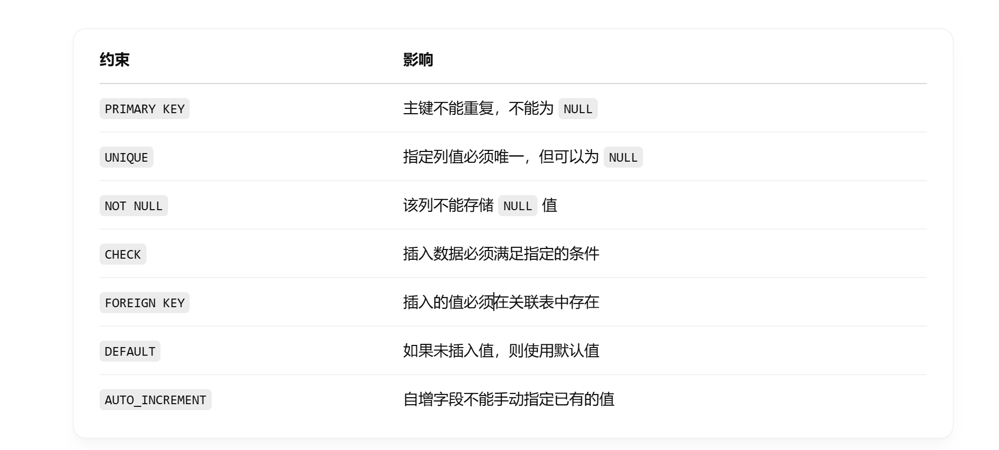

```java
1
xxxxxxxxxx1 1//密码是123456
```


MySQL 是一个关系型数据库管理系统

关联数据库将数据保存在不同的表中，而不是将所有数据放在一个大仓库内，这样就增加了速度并提高了灵活性

MySQL数据库和SQL语言

数据和信息的区别

实体 属性 联系

联系

```java
1
//多对多等
```

关系型数据模型

```java
1
//数据结构：二维表
2
//数据操作是集合操作，操作对象和操作结果都是表（增删改查）
3
//关系的完整性约束条件
4
//实体的完整性：禁止重复属性
5
//参照的完整性：如工资发放：有名字才可以发工资（可以理解为规定）
```

```java
1
数据库数据
2
//数据库数据：永久存储，有组织，可共享三个基本特点。(集合)
3
//可共享多个子系统共享一个表，减少出错，减少冗余度
```

数据库管理系统

```java
1
//用SQL语言实现对数据的增删改查等操作，简化操作。如MySQL，支持关系型数据库。
```

数据库语言

```java
1
//DDL：数据描述语言：
2
//DML：数据操作语言
3
//DCL：数据安全语言
```

数据库系统        // DBMS数据库管理系统（可以创建DB） DB数据库（各种表）

```java
1
//前端 后端 数据库
2
//外模式（不同系统关注的数据不同）<----模式（逻辑结构）————>内模式（物理数据库，具体物理操作）
3
//模式与外模式的映像：查找需要的数据，模式改变，程序代码不变（数据与程序的逻辑独立性）
4
//模式与内模式的映像：内模式改变，模式不变（数据的wu'l）
```

域

```java
1
//域是是一组具有同种特征的数值的集合。
```

笛卡尔积

```java
//两个或多个集合中的元素的排列。 (自由组合)
//度的概念：几列 几行。
//只要有意义的数据-->得到关系。如姓名-->年龄-->籍贯。，所以由最短行确定。
元组：一行
    属性或字段：一列。
//唯一的（不重复的属性）-->关系的码（键，候选码）。
//每一个关系都有一个且只有一个主键。
//键：可以确定其他属性，（不重复造成）从表中确定。
    //外键：某一个属性（或多个属性（属性集合））在另一个关系中的主键，-->叫外键。
//外键：是参照，有取值范围，和其他表保持一致。
```

关系模式：对关系的描述

```java
//如：STUDENT（SNO，SNAME。。。。。）
//学生（学号，姓名。。。）
```

完整性约束

```java
//实体的完整性：主键禁止重复属性，不能为空
//参照的完整性：如工资发放：有名字才可以发工资（可以理解为规定），可以为空（如：职工的部门（外键，在部门表）可以为空，取值参照部门表。防止进入不存在的部门。）职工表的部门编号，参照部门表中主键部门编号，
//外键为主键时不能为空。
//用户自定义完整性（域完整性）：约束其它字段的值。（性别只有：男女，域中有才可以自定义。）。			
```

```java
//a2 a3 第二个表中的空缺  实体的完整性
//b6  参照的完整性
//c 5  用户自定义完整性
```

**运算**

并

```java
//去掉相同的两行
//合并不同的。
```

R*S

1.选择（一个表）

```java
//从关系中选择满足指定条件的元组。
```

2.投影（一个表）

```java
/Π
```

3.连接

```java
//可以规定连接的条件，而不是全部连接。
```


关系模型

```java
//定义具有约束关系的数值（行）
//完成增删改查。
```

```java
普通的交并差
投影  排
//获取对应的列。
选择   6
//获取符合条件 的行。
连接
//连接：根据条件合并两表。（一一匹配符合条件的连接）
//自然连接：连接条件：公共属性相等。 运算满足交换律。
//连接的目的是补充信息。
//连接的时候注意是否可以连接（顺序问题）。
  投影只保存有用的列。
外连接
左外连接
右外连接
//左外连接，保留左表，与右表连接，有连接，没有，剩余的属性（左表中没有的元素）取null
全外连接
//左外连接和右外连接都要。
   //匹配成功的就连接，没有匹配的其他元素取null。
除法
//象集：属性（属性集合）取某值时，其他属性的取值。
    //不公共的元素取象集
    
```

修改的步骤：先删除，在插

```java
//先选择，选择的查找的个数少。
```

```java
//数据定义语言
DDL
    create 
    alter //
    drop   //删除表
```


```java
//存储引擎 InnoDB（MySQL支持的存储引擎）。
create
    drop
    alter
    select
    insert
    update
    delete
```

```java
if not exisis
    paimary key comment
    default
```

```java
decimal()
    char(8)//固定长度的，空间固定
    varchar（30）//可变，最大30个空间。
    primary
```



```sql
CREATE TABLE IFNOT EXISTS student(
sno CHAR(20) PRIMARY KEY,
    
)
//一定有规范好参照完整性约束
on delete set null //它作为外键被删除时，参照它的置空
on update cascade  //它修改时（改名），参照它的值同步修改
```

```java
tinyint unsigned//非负的
data 
    time
    year
```

表结构的修改

```java
//添加字段
alter table studet add name varchar(20)
//修改类型
    modify
    //修改字段名和字段类型
    alter table student change 
```

```java
//alter 改变	
```


```java
//alter table student drop name;
```


```java
truncate table
```

DDL

```java
//drop 由于删除
//create 创建
//alter 修改 add modify change drop rename to
```

DML：数据操作语言


```java
insert 
update
delete
    insert into stuent（） values（）；
    //添加多个记录
```


修改数据


总结


DQL语句

```
//查询 select
```


```java
//基本查询
select 字段 as 别名 from 表
//去重
    select distinct name '名字' from emp;
//条件查询

```


```java
//select *from emp where managerid is null;
//查是否为空
select *from emp where managerid is not null;
select *from emp where age>=15 &&age<=200;
select *from emp where age>=15 and age<=200;
select *from emp where between 15 and 20;


 多选一
     select *from emp where age =18 or age = 20 or age =40;
	select * from emp where age in(18,29,40);
//模糊匹配
//% 任意位字符
select * from emp where name like '_ _'; //两个字
select * from emp where name like '%X';//最后一位是X 
```

聚合函数


```java
select count（*） form emp; 
select count(id) from id; //一共有多少id null不算
```


```java
//先统计后分组
```


内置函数

字符串函数

```JAVA
concat
    lower
    upwer
    lpad
    rpad
    trim
    substring
    
```


数值

函数


日期函数


```

```


```java
//select name, datediff(curdate(),enterdate) from emp
//名字和名字对应的日期，在一行，可以进行操作
```

执行顺序

```java
//where
//分组
//函数和挑选
//排序 
//分叶
```

流程控制函数

```java
select 
    name,
	(case workaddress when '北京' then '一线城市' when '上海'then '一线城市'else '二线城市') as '工作地址'
```

```java
//函数都是对某一行的数据经行处理
```

约束


```java
primary key auto_increment;
unique
    //主键 非空，唯一。
```

外键

```java
//保证子表的外键数值来自父表的主键
```


```jvaa
constranit fk

```


```java
cascade 同步发生变化 改变改变，删除也删除
```

```java
//foreign key
```

多表查询 DQL

```java
select * from emp，dept //每一个都匹配一遍 
    //消除无效的笛卡尔积
select * from emp,dept where emp.id = dept.id;
```

先找行，后找列


内连接


隐式

```java
select *from emp，dept where ---；
```

```java
//起晚别名后用where只能用别名
```

显式

```java
select emp.name,dept.id from emp inner join dapt on emp.id = dapt.id.
```


```java
left right
    //外连接存在主体。
```

自连接


联合查询


```java
select * from emp where sarary》5000
    union all//不会去重
    union//去重
    //联合的条件是列数相同，字段类型也要一致
```

子查询


标量子查询；


视图

```java
//动态生成
```


```java
create or replace view vi as select * from student;
查询
    show create view vi;
//和表一样
	select * from vi;//查看视图数据
//可以加条件
修改
    create or replace view as ...;
	alter view vi as selec....;
删除
    drop view if exists vi;
```

```java
insert into stu_v_1 values(6,'Tom'); //插入到原表中，可能查不到
create or replace view stu_v_1 as select id,name from student where id <= 20 with cascaded/local check option
    //保证视图可以咨询，检查创建语句
    用视图创建视图，会继承视图的判断条件，来限制插入的数据，但是没有cascaded/local check option不会检查自身的条件
```


索引

```java
index 索引
    fulltext index 名字 （）；//以谁为索引。
```

连接时，只会保留符合条件的列。

```java
database 数据库
    create 创建
    exists 存在
    decimal（4，1）//999.9；
    alter 修改
    constraint
    //对框架进行修改
    alter table student add 
    					drop
    					change
    					modify
```


```java
CREATE TABLE Course (
    CNo     VARCHAR(10) PRIMARY KEY,         -- 课程编号，主键，唯一标识每门课程
    CName   VARCHAR(50),                     -- 课程名称
    CCredit DECIMAL(3,1),                    -- 学分，如：3.0、2.5 等
    TNo     VARCHAR(10),                     -- 授课教师编号，是外键，关联 Teacher 表

    FOREIGN KEY (TNo) REFERENCES Teacher(TNo) -- 外键约束，TNo必须在Teacher表中存在
);
forign key （TNo） references
```


```java
forign key （TNo） references
    AUTO_INCREMENT  auto_increment
    cascade
    //二级索引的用处：增加查询速度
```

```java
order by  Student.name ASC;

    avg(SC.Grade), 平均
    max(SC.Grade), 最大
    count(sc.CNo) 总数
        匹配用 like;
```

数据库设计

```
数据建模

需求：包括：功能和数据需求
功能需求：是对数据的处理
数据需求：是将现实中的实体(个体集合)-->信息世界的关系模型（重点是我们有哪一些表和表与表中的联系）

//实体转换成一张表
//联系转换为表
工资卡不重复，外键（属于工资卡）
//多对多的联系转换为一个独立的表
//谁是主键，（单独来一个id）
```


```java
create procedure p1()
```

```sql
#创建存储过程
create procedure p2()
begin

end
#调用
call p2();
```

```java
#查看
    show create procedure p1;
#删除
    drop procedure if exists p1;
```

```java
概念结构设计：E-R设计
逻辑结构设计：表的设计
物理结构设计：用产品在电脑上运行数据库，建表，在物理层面实现数据库。
    

//一端的主键拿到多端
//多对多：拿各自的主键+联系的属性组成一个新表。主键是公共的，或者用id（新建）。
//实体用：正方形 联系用菱形，属性用圆圈。
```

```java
//正向工程：
```

```java
//用户自定义变量
@变量名
    //作用域：当前连接
    
```


```java
set @myname = 'itcast';
set @mygender :='男',@aa = 12;
//推荐使用 ：=
select @mycolor = 'red'
select count(*) into @mycount from tb_user;
//使用
select @myname,@myaaa;
```


```java
declare
create procedure p2()
    begin
    declare stu_count int defalt 0;
	set stu_
    end;
```

范式理论

```java
数据库的问题：
    数据冗余 冗余存储
    插入异常 即主键必须唯一且非空 主键不完整，无法插入
    修改，更新，删除异常 过多
```

函数依赖

```java
数据依赖：属性之间的关系
    函数依赖：基础的 
    x决定y 行x值相等y值必然相等
    //函数依赖的分类
    完全函数依赖 已经是最小的确定关系了
    部分函数依赖：其中的一个属性，照样可以确定y
    传递函数依赖：重点y相对于x是独立的。
```


范式

```java
//第一范式：属性不可分，是一个关系模式
//第二范式：每一个非主属性完全依赖于主键（R的码） 分开候选码。
//第三范式：在第二范式的基础上不存在传递依赖
```


```java
//凡是可以通过其他属性计算出来的属性，都不是实体的固有属性
```

反范式设计

```
以空间换时间
```


数据库的安全性


事务

```java
要么同时成功要么同时失败 
    select * from account where name = ‘张三’；
    update account set money = money -1000 where name = '张三';
	update account set money = money +1000 where name = '李四';

事务
    每条sql都是事务 事务自动提交
    默认自动提交；
    //事务控制 
    select @@autocommit;
//给为手动提交
set @@aueocommit = 0;
在内存中已经执行完。但没有提交。
    //提交事务
    commit；
    //回滚事务
    rollback
    //取消上传更新。
    
    
 //方式二
    //开启事务
    start transaction  //意思是手动提交事务
    //执行事务
    commit
    rollback 
```

并发事务问题

```java
脏读

```

原子性

一致性

隔离性

持续性


排他锁  x锁：写锁 事务上锁后 独享，其他事务不可操作，该事务可以读取和修改

s锁 共享锁：读锁：只能读，不能修改：事务加上的，加上之后其他事务也只能加读锁，直到

```java
select * from account where account_name = 'A 
    lock in share mode;
```


数据库的安全